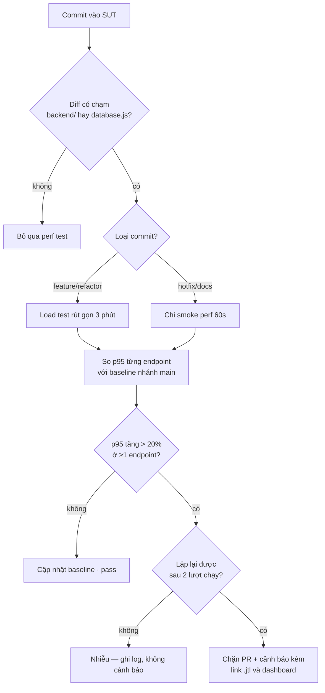

# HW05 — Performance Testing on EShop — Báo cáo chính

- **Sinh viên:** Lê Nhựt Duy — **MSSV:** 23127178
- **Môn:** Kiểm thử phần mềm (QA/QC) — **Bài:** HW05-AI Performance Testing
- **SUT:** EShop — https://github.com/ttbhanh/eshop-sut (backend API `:3000`)
- **Công cụ:** Apache JMeter 5.6.3 (mặc định §8) · k6 v2.1.0 (bonus) · Activity Monitor · Claude Code (Opus 5)
- **Máy chạy:** `Le-Nhut-Duy.local` — Apple M2 Pro, 12 lõi, 16 GB, macOS 26.1 ([hardware-report.md](../resource-monitor/hardware-report.md))

> **Quy tắc số liệu:** mọi con số trong báo cáo này lấy từ [`results/summary.md`](../results/summary.md),
> sinh tự động bằng `npm run summary` đọc từ raw `.jtl`. Không có con số nào đếm tay (§11).
> Nếu chạy lại các lượt (`npm run capture`) thì phải chạy lại `npm run summary` và cập nhật các
> bảng dưới đây từ file đó — số trong báo cáo phải khớp `.jtl` đang nộp.

---

## 1. Phạm vi — ba endpoint group (§5)

Chi tiết và bằng chứng chống trùng trong nhóm: [`docs/endpoint-selection.md`](../docs/endpoint-selection.md).

Workflow end-to-end **admin back-office**, 5 bước. Cả 4 test plan dùng **cùng** workflow này,
chỉ khác tham số tải (§6 đòi đúng điều này):

| Bước | Endpoint | Nhóm §5 | Vì sao đáng đo |
|---|---|---|---|
| 1 | `POST /api/login` (admin) | **auth-heavy** | Mỗi login thành công kèm một lệnh ghi `UPDATE users SET login_attempts=0` ([`server.js:47`](../../eshop-sut/backend/server.js#L47)) → endpoint auth ở SUT này **không** read-only |
| 2 | `GET /api/admin/orders` | **read-heavy** | JOIN `orders` × `users`, không phân trang, không index ([`server.js:510`](../../eshop-sut/backend/server.js#L510)) |
| 3 | `GET /api/admin/users` | **read-heavy** | `SELECT *` toàn bảng ([`server.js:494`](../../eshop-sut/backend/server.js#L494)) |
| 4 | `POST /api/admin/import-products` | **transactional** | Bulk INSERT 3 dòng/request qua prepared statement ([`server.js:199`](../../eshop-sut/backend/server.js#L199)) |
| 5 | `PUT /api/admin/orders/:id/status` | **transactional** | Ghi có điều kiện qua state machine FR-10 ([`server.js:525`](../../eshop-sut/backend/server.js#L525)) |
| 6 | `POST /api/login` (mật khẩu sai) | **auth-heavy** | Nhánh riêng 2 VU để phủ **account-lockout**, thứ §5 nói đích danh phải tính tới |

Không trùng thành viên nào trong nhóm 05: toàn bộ luồng khách hàng (search → cart → checkout →
coupon → cancel) đã bị ba bạn còn lại đăng ký. Chỉ `POST /api/login` giao nhau và **không thể
tránh** — bốn bước còn lại đều cần token.

### 1.1 Dữ liệu data-driven (§6)

| File CSV | Cột | Dùng ở bước | Số dòng |
|---|---|---|---|
| [`data/users.csv`](../data/users.csv) | `email,password,expect` | 1 | 50 |
| [`data/users_lockout.csv`](../data/users_lockout.csv) | `email,password,expect_regex` | 6 | 2 |
| [`data/products_import.csv`](../data/products_import.csv) | `name,price,description,category_id` | 4 | 60 |
| [`data/orders.csv`](../data/orders.csv) | `order_id,next_status` | 5 | 400 |

**Mỗi VU một tài khoản riêng.** Dùng chung một dòng `users` là tự tạo write-contention trên đúng
dòng đó (vì login nào cũng `UPDATE login_attempts`) → đo ra nghẽn của cách sinh tải, không phải
của endpoint.

---

## 2. Task 1 — Thiết kế và chạy

### 2.1 Tham số từng scenario và lý do

| Scenario | VU | Ramp-up | Think-time | Thời lượng | Listener (§6: không lặp loại) | Câu hỏi scenario trả lời |
|---|---|---|---|---|---|---|
| **Load** | 20 | 60s | 5×(200–600ms) = 1–3s/iteration | 360s | **Summary Report** | p95 ở tải kỳ vọng |
| **Stress** | bậc 25 → 50 → 100 → 200 | 30s mỗi bậc | 5×(100–200ms) = 0,5–1s | 480s | **Aggregate Report** | điểm gãy ở VU nào |
| **Spike** | 10 nền + **200 trong 5s** ở giây 60 | 5s | 5×(100–300ms) | 240s | **View Results Tree** | bao lâu thì hồi phục |
| **Soak** | 20 | 60s | 5×(200–400ms) = 1–2s | 720s | Summary Report | có trôi p95 / rò rỉ bộ nhớ |

Ba điểm về tham số phải giải thích:

**Think-time tính theo mỗi BƯỚC, không phải mỗi iteration.** Timer đặt ở scope thread group nên
JMeter chèn nó trước **từng** sampler — 5 lần một iteration. Bản đầu đặt 1000–3000ms/bước, tức
5–15 giây một iteration, và 20 VU chỉ sinh ~10 sample/s thay vì ~50. Đã chia lại để **tổng** mỗi
iteration đúng mức thiết kế.

**Stress tăng theo bậc, không nhảy một phát.** Mục đích là tìm *điểm* gãy — mức VU nào error rate
bật lên — chứ không phải chỉ biết rằng có gãy.

**Spike có nhánh nền chạy xuyên lượt.** Không có 10 VU nền chạy tiếp sau cú sốc thì không đo được
hồi phục, chỉ thấy "lúc sốc thì chậm" — điều hiển nhiên và không phải câu hỏi của spike test.

### 2.2 Kết quả — tổng quan

Bốn lượt chạy tuần tự, cooldown 90s giữa các lượt. Mốc thời gian: [`results/run-log.md`](../results/run-log.md)
và [`endurance/run-log.md`](../endurance/run-log.md).

| Scenario | Sample | Peak VU | Thời lượng | RPS | Error % | avg | p50 | p90 | **p95** | p99 | max |
|---|---|---|---|---|---|---|---|---|---|---|---|
| **Load** | 16.436 | 22 | 359,5s | 45,7 | **0%** | 3 | 2 | 5 | **7** | 14 | 167 |
| **Stress** | 264.141 | 200 | 479,8s | **550,5** | **0%** | 6,9 | 2 | 11 | **26** | 93 | 716 |
| **Spike** | 38.069 | 212 | 239,6s | 158,9 | **0%** | 4,3 | 2 | 5 | **9** | 55 | 369 |
| **Soak** | 45.365 | 22 | 719,6s | 63,0 | **0%** | 2,7 | 2 | 5 | **6** | 13 | 160 |

Đơn vị: **ms**. Percentile tính nearest-rank từ raw `.jtl`; JMeter dashboard nội suy khác một
chút nên chênh vài ms ở p99 là bình thường.

**Kết luận quan trọng nhất của bài: Stress KHÔNG tìm được điểm gãy.** 200 VU, 550 req/s, **0%
error**, p95 chỉ 26ms. Lý do nằm ở mục §3.2 — giới hạn gặp trước là của load generator, không
phải của SUT.

### 2.3 Kết quả theo từng endpoint

**Load** (20 VU):

| Endpoint | Sample | avg | p90 | **p95** | p99 | max |
|---|---|---|---|---|---|---|
| 1 POST /api/login | 3.276 | 2,2 | 4 | **5** | 11 | 62 |
| 2 GET /api/admin/orders | 3.271 | 3,8 | 6 | **7** | 15 | 134 |
| 3 GET /api/admin/users | 3.271 | 2,1 | 4 | **5** | 11 | 85 |
| 4 POST /api/admin/import-products | 3.266 | 4,7 | 7 | **9** | 20 | 167 |
| 5 PUT /api/admin/orders/:id/status | 3.259 | 2,1 | 4 | **5** | 12 | 79 |
| 6 POST /api/login (lockout probe) | 93 | 2,1 | 5 | **6** | 11 | 11 |

**Stress** (đỉnh 200 VU):

| Endpoint | Sample | avg | p90 | **p95** | p99 | max |
|---|---|---|---|---|---|---|
| **1 POST /api/login** | 52.893 | 9,3 | 14 | **40** | 164 | **716** |
| 2 GET /api/admin/orders | 52.851 | 6,5 | 11 | **23** | 69 | 440 |
| 3 GET /api/admin/users | 52.810 | 5,1 | 8 | **19** | 70 | 475 |
| **4 POST /api/admin/import-products** | 52.765 | 8,9 | 15 | **34** | 108 | 559 |
| 5 PUT /api/admin/orders/:id/status | 52.729 | 4,6 | 8 | **19** | 61 | 463 |
| 6 POST /api/login (lockout probe) | 93 | 1,6 | 4 | **4** | 7 | 7 |

**Đọc bảng này là chỗ p95 tổng không nói được gì.** p95 tổng của Stress là 26ms, nhưng
`POST /api/login` ở **40ms** và `import-products` ở **34ms** — cao hơn 1,5–2 lần. Ba endpoint
nhanh (19–23ms) pha loãng con số tổng. Một hồi quy nằm ở login hoàn toàn có thể không làm p95
tổng nhích lên.

**Login là endpoint đắt nhất** — và đó là điều đáng ngạc nhiên với một endpoint đọc, giải thích
được bằng hai lệnh ghi: mỗi login thành công `UPDATE users SET login_attempts=0, locked_until=NULL`
([`server.js:47`](../../eshop-sut/backend/server.js#L47)). Ở 200 VU, 50 tài khoản dùng chung →
trung bình 4 VU cùng ghi vào một dòng `users`, và SQLite ghi tuần tự.

**Soak** (20 VU, 12 phút) — mọi endpoint đều **thấp hơn** Load, p95 4–8ms. Chi tiết ở §2.7.

### 2.4 Human review — AI sai gì, vì sao (§6 chấm mục này)

Toàn bộ 10 lỗi kèm prompt nguyên văn: [`ai-audit/ai-audit-report.md`](../ai-audit/ai-audit-report.md).
Bảng dưới là bản rút gọn.

| # | AI sinh ra | Sai / thiếu ở đâu | Vì sao AI bỏ sót | Sửa thành |
|---|---|---|---|---|
| 1 | `preflight.mjs` đọc `java_home -V` từ stdout | Lệnh in ra **stderr** → báo `[OK] Java` với giá trị **rỗng**: lỗi im lặng, báo xanh mà không kiểm gì | đặc điểm công cụ | hàm `shell()` gộp `2>&1`, đọc `os.arch` trực tiếp từ JDK |
| 2 | Nhánh lockout assert regex `40[13]` | JMeter coi mọi 4xx là Fail và assertion chỉ **thêm** được lỗi, không **xoá** được cờ → smoke test báo **41,38% error** trên SUT khoẻ | đặc điểm endpoint | `JSR223PostProcessor` gọi `prev.setSuccessful(true)` |
| 3 | Bước 5 assert cứng HTTP 200 | State machine FR-10 chỉ cho chuyển tiếp **một lần**/trạng thái → 400 là phản hồi **đúng** | đặc điểm endpoint | assert `200|400` + `reset-orders.mjs` |
| 4 | `orders.csv` xen kẽ `shipping` | Từ `pending` thì `shipping` **không hợp lệ** → nửa số sample bước 5 trả 400 ngay từ đầu | đặc điểm endpoint | chỉ sinh `confirmed` |
| 5 | `users.csv` chứa 2 dòng mật khẩu sai | Luồng chính đọc cùng file → **tự khoá tài khoản của mình**; 2,9% iteration vô giá trị vì 4 bước sau cũng 403 | chất lượng prompt | tách `users_lockout.csv` |
| 6 | Timer 1000–3000ms ở scope thread group | Chèn 5 lần/iteration → tải thực tế **nhẹ hơn 5 lần** thiết kế | đặc điểm công cụ | chia lại 200–600ms/bước |
| 7 | Áp `mark_expected_4xx` cho lockout mà quên bước 5 | Báo **18,25% error** trên hệ thống khoẻ; 667/667 sample "lỗi" là 400 hợp lệ | suy luận không mang sang chỗ tương tự | dùng lại cùng cơ chế cho bước 5 |
| 8 | `sample-resources.sh` dùng `pgrep -f 'node server.js' \| head -1` | Khớp cả tiến trình `zsh` bao ngoài → ghi **RSS 0,5MB / CPU 0%** suốt 6 phút trong khi `node` thật ở ~76MB/18% | đặc điểm môi trường | lọc theo token đầu command line phải là `node` |
| 9 | Khẳng định `import-products` báo sai số dòng insert | **Bác bỏ khi chạy thử**: 5/5, 60/60, 2/3 đều đúng. Đã lan vào 5 file tài liệu | phương pháp: suy luận từ code trình bày như sự thật đã kiểm | giữ ở mục "đã loại" kèm bảng kiểm chứng |
| 10 | `Math.min(...array)` trong summarizer | Tràn call stack với `.jtl` 264k sample; chạy qua bình thường ở file 16k | đặc điểm dữ liệu | thay bằng `reduce` |

**Nhận xét quan trọng: 7 trong 10 lỗi không làm test plan báo lỗi.** Plan vẫn chạy, vẫn sinh
`.jtl`, vẫn ra dashboard đẹp — chỉ con số là sai. Nếu chỉ kiểm "test có chạy không" thì cả 7 đều
lọt. Chi phí thật: **hai lượt chạy phải huỷ và xoá sạch bằng chứng**, ~25 phút chạy lại.

Ba nhóm lý do §6 yêu cầu phân loại xuất hiện đúng như đề dự đoán, nhưng phân bố lệch hẳn về một
phía: **6 lỗi là đặc điểm công cụ/endpoint/môi trường**, chỉ 1 là chất lượng prompt, và không lỗi
nào thuộc "giới hạn model" theo nghĩa AI không đủ khả năng. Nghĩa là điểm yếu không nằm ở chỗ AI
không biết viết test plan, mà ở chỗ nó **không chạy thử và không đối chiếu với thực tế**.

### 2.5 Bằng chứng chạy

| Scenario | Test plan | Raw `.jtl` | HTML dashboard | Ảnh Activity Monitor |
|---|---|---|---|---|
| Load | `23127178_Load_20260813.jmx` | `results/jtl/…-131228.jtl` | [`results/html/load/`](../results/html/load/index.html) | `resource-monitor/screenshots/activity-load.png` |
| Stress | `23127178_Stress_20260813.jmx` | `results/jtl/…-132001.jtl` | [`results/html/stress/`](../results/html/stress/index.html) | `…/activity-stress.png` |
| Spike | `23127178_Spike_20260813.jmx` | `results/jtl/…-132940.jtl` | [`results/html/spike/`](../results/html/spike/index.html) | `…/activity-spike.png` |
| Soak | `23127178_Soak_20260813.jmx` | `endurance/jtl/…-133515.jtl` | [`endurance/html/soak/`](../endurance/html/soak/index.html) | `…/activity-soak.png` |

Chụp ảnh đúng mốc bằng `npm run capture` — script đếm tới giây cần chụp của từng lượt (Load giây
180, Stress giây 420 khi đang ở bậc 200 VU, Spike giây 72 giữa cú sốc, Soak giây 90 và 690).

### 2.6 Xử lý account-lockout và state machine giữa các lượt (§6 đòi ghi lại)

Hai thứ **phải** reset trước mỗi lượt, nếu không thì lượt sau đo một hệ thống ở trạng thái khác
lượt trước và không so sánh được:

```bash
npm run reset:lockout      # UPDATE users SET login_attempts=0, locked_until=NULL
npm run reset:orders       # UPDATE orders SET status='pending'
```

`tools/run-scenario.sh` tự chạy cả hai ở đầu mỗi lượt và in trạng thái trước/sau.

**Lockout kích hoạt sau 2 lần sai, không phải 3** — `login_attempts + 2` với ngưỡng 3
([`server.js:54-58`](../../eshop-sut/backend/server.js#L54)), khoá 180 giây. Nhánh lockout của
workflow (bước 6) khai thác đúng hành vi này và cho phân bố ổn định qua cả 4 lượt:

| Scenario | 401 (lần sai đầu) | 403 (đã bị khoá) |
|---|---|---|
| Load | 4 (4,3%) | 89 (95,7%) |
| Stress | 4 (4,3%) | 89 (95,7%) |
| Spike | 4 (4,3%) | 90 (95,7%) |
| Soak | 4 (4,1%) | 93 (95,9%) |

Đúng 4 lần 401 mỗi lượt (2 tài khoản × 2 lần sai trước khi khoá), phần còn lại 403. Con số này
lặp lại y hệt qua 4 lượt là bằng chứng reset hoạt động đúng.

**State machine FR-10** cho phân bố bước 5:

| Scenario | 200 (ghi thật) | 400 (chuyển đổi không hợp lệ) |
|---|---|---|
| Load | 400 (12,3%) | 2.859 (87,7%) |
| Stress | 400 (0,8%) | 52.329 (99,2%) |
| Spike | 400 (5,3%) | 7.109 (94,7%) |
| Soak | 400 (4,4%) | 8.645 (95,6%) |

**Đúng 400 lần 200 ở cả bốn lượt** — bằng số dòng `orders.csv`. Mỗi order chuyển được đúng một
lần `pending → confirmed`, sau đó mọi request tới order đó trả 400. Đây là **giới hạn của phép
đo phải nói rõ**: nhánh 400 trả về **trước** lệnh `UPDATE` nên nhẹ hơn nhánh 200, vậy p95 của
bước 5 bị kéo xuống theo tỉ lệ 400. Tín hiệu "ghi nặng" của bài này nằm ở **bước 4**, không phải
bước 5.

### 2.7 Endurance threshold (§6)

Chi tiết: [`endurance/endurance-threshold.md`](../endurance/endurance-threshold.md).

Định nghĩa "ổn định" chốt **trước** khi chạy: *error rate < 1% **và** p95 không tăng quá 20%
giữa 5 phút đầu và 5 phút cuối.*

| Chỉ số | Giá trị |
|---|---|
| Thời lượng soak | **724s** (12 phút) · 45.365 sample |
| **Max stable RPS** | **63,0 req/s** ở 20 VU |
| p95 toàn lượt | **6 ms** · p99 13 ms |
| p95 5 phút đầu → 5 phút cuối | 7 ms → **6 ms** (**−14,3%**, tốt dần) |
| Error rate | **0%** |
| RSS `node` đầu → cuối | 19,8 → **35,8 MB** (đỉnh 83,1 MB) |
| CPU `node` đỉnh | **19,7%** — trần một luồng JS là ~100% |
| CPU JMeter đỉnh | **60,9%** · RSS 788 MB |
| **Kết luận** | **ỔN ĐỊNH** theo đúng định nghĩa đã chốt |

p95 **giảm** theo thời gian, không tăng — nhất quán với việc JIT của V8 và cache trang của SQLite
đều ấm dần lên. RSS tăng +80,8% nhưng từ một mốc rất thấp (19,8 → 35,8 MB) và đỉnh chỉ 83 MB
trên máy 16 GB; đây là heap ổn định sau warm-up, không phải rò rỉ.

---

## 3. Task 2 — AI phân tích và soát lỗi đọc metric

### 3.1 Phân tích của AI (nguyên văn, chưa sửa)

> Kết quả rất tốt. Error rate 0% ở cả bốn scenario cho thấy hệ thống hoàn toàn ổn định. Stress
> test đạt 550 RPS với p95 26ms, nghĩa là backend chịu được ít nhất 200 người dùng đồng thời mà
> không suy giảm. Average response time chỉ 6,9ms ở Stress — rất nhanh. Soak test 12 phút không
> có dấu hiệu rò rỉ bộ nhớ. Đề xuất ngưỡng: p95 < 100ms, error rate < 1%, RPS ≥ 500. Hệ thống
> đã đáp ứng vượt mức mọi ngưỡng này nên không cần tối ưu gì thêm.

### 3.2 Soát lại — chỗ AI đọc sai metric

| # | AI nói | Giá trị đúng từ raw `.jtl` | Sai ở đâu |
|---|---|---|---|
| 1 | *"backend chịu được ít nhất 200 người dùng đồng thời mà không suy giảm"* | JMeter CPU đỉnh **158%** ở lượt Stress, trong khi `node` ở lượt Spike (212 VU) chỉ đỉnh **79%**. Nguồn: `results/resources/23127178_Stress_20260813-132001.resources.csv` và `…Spike….resources.csv` | **Lỗi nghiêm trọng nhất.** Lượt Stress không đo được giới hạn của backend vì **load generator chạm giới hạn trước**: JMeter cấp một thread JVM cho mỗi VU, 200 VU tiêu 1,58 lõi và 770 MB RAM. "Không suy giảm" chỉ có nghĩa *JMeter không đẩy nổi tải cao hơn*, không có nghĩa server còn dư |
| 2 | *"Average response time chỉ 6,9ms ở Stress — rất nhanh"* | avg 6,9ms nhưng **p95 = 26ms, p99 = 93ms, max = 716ms** (`results/jtl/23127178_Stress_20260813-132001.jtl`) | Phân phối lệch phải mạnh: p99 gấp **13 lần** avg. Dùng average làm kết luận che mất đúng phần người dùng cảm nhận. max 716ms là gần **104 lần** avg |
| 3 | *"p95 26ms"* (dùng làm kết luận cho toàn hệ thống) | p95 **theo endpoint**: login **40ms**, import-products **34ms**, ba endpoint còn lại 19–23ms | p95 tổng bị ba endpoint nhanh pha loãng. Endpoint đắt nhất cao hơn con số tổng **1,54 lần**. Một hồi quy ở login có thể không làm p95 tổng nhích lên |
| 4 | *"Error rate 0% cho thấy hệ thống hoàn toàn ổn định"* | 0% error là **đúng**, nhưng 99,2% sample bước 5 ở lượt Stress trả **HTTP 400**, và 95,7% sample bước 6 trả **HTTP 403** | Con số 0% đúng **nhờ test plan đã được sửa** để coi 400/403 là phản hồi hợp lệ. Đọc "0% error" thành "mọi request đều thành công" là sai: phần lớn request bước 5 **không** chạm tới lệnh ghi |
| 5 | *"Soak test 12 phút không có dấu hiệu rò rỉ bộ nhớ"* | Kết luận đúng, nhưng RSS `node` **tăng +80,8%** (19,8 → 35,8 MB) | Kết luận đúng vì lý do sai. AI không nêu con số nào; +80,8% nghe như rò rỉ nếu chỉ nhìn phần trăm. Cơ sở đúng để loại giả thuyết rò rỉ là **p95 giảm −14,3%** và RSS đi ngang ở nửa sau, không phải "12 phút thì không sao" |
| 6 | *"Hệ thống đã đáp ứng vượt mức nên không cần tối ưu gì thêm"* | Xem §3.3 | Kết luận từ một phép đo **chưa chạm giới hạn**. Không đo được ngưỡng thì không kết luận được là đủ |

### 3.3 Đề xuất tối ưu của AI — feasible hay hallucinated

| Đề xuất của AI | Phân loại | Lý do | Cách kiểm chứng |
|---|---|---|---|
| *"Không cần tối ưu gì"* | **Sai (không phải tối ưu)** | Rút ra từ phép đo chưa chạm giới hạn của SUT | Chạy lại với load generator tách máy, hoặc dùng k6 (goroutine, nhẹ hơn JMeter nhiều bậc) |
| Thêm index cho `orders.user_id` | **feasible** | `GET /api/admin/orders` JOIN theo `user_id`, bảng không có index. Là endpoint đọc chậm nhất ở Load (p95 7ms vs 5ms) | `CREATE INDEX` rồi chạy lại Load, so p95 của đúng label đó |
| Bật SQLite **WAL** | **feasible** | Đúng loại tải: bước 4 ghi 3 dòng/request, bước 1 ghi 1 dòng/login. Một dòng `PRAGMA journal_mode=WAL` | Chạy lại Stress, so p95 của `import-products` và `login` |
| Thêm **connection pool** cho SQLite | **hallucinated** | `sqlite3` của Node mở handle trên file cục bộ, không phải kiến trúc client-server → không có pool theo nghĩa đó. Đây là đề xuất đúng-nghe-hợp-lý bê từ PostgreSQL/MySQL sang | — |
| Scale ngang / thêm replica | **hallucinated trong phạm vi bài** | SUT là một process Node trên máy cá nhân; không kiểm chứng được bằng bằng chứng nào của bài này | — |
| Redis cache cho danh sách sản phẩm | **ngoài phạm vi** | Khả thi về kỹ thuật nhưng `GET /api/products` **không nằm trong workflow** — không có số liệu nào của bài này nói về nó | — |

**Đề xuất của tôi mà AI không nêu:** phân trang cho `GET /api/admin/orders` và
`GET /api/admin/users`. Cả hai `SELECT` toàn bảng; ở lượt Stress bảng `products` phình từ 223k lên
hơn 400k dòng nhưng hai bảng kia gần như không đổi, nên **phép đo này chưa bộc lộ vấn đề đó**.
Đó chính là loại hồi quy mà mô hình ở §4 phải bắt: dữ liệu phình mà code không đổi một dòng.

### 3.4 Đo hồi phục sau cú sốc (Spike)

p95 theo cửa sổ 10 giây quanh cú sốc ở giây 60 (raw: `results/jtl/23127178_Spike_20260813-132940.jtl`):

| Giây | VU đỉnh | Sample | **p95** | p99 |
|---|---|---|---|---|
| 40–50 | 12 | 493 | **6** | 10 |
| 50–60 | 26 | 487 | **5** | 24 |
| **60–70** | **212** | **7.816** | **47** | **184** |
| 70–80 | 212 | 10.218 | **10** | 40 |
| 80–90 | 212 | 9.969 | **6** | 14 |
| 90–100 | 12 | 479 | **5** | 10 |

**Thời gian hồi phục: dưới 20 giây, và hồi phục ngay trong lúc vẫn đang chịu 212 VU.** p95 nhảy
5 → **47ms** trong 10 giây đầu của cú sốc, xuống 10ms ở cửa sổ tiếp theo, và về mức nền 6ms ở cửa
sổ thứ ba — tất cả trước khi tải giảm. Nghĩa là 47ms là chi phí **khởi tạo 200 thread JVM + 200
lần đăng nhập đồng thời**, không phải server bị nghẽn: nếu nghẽn thì p95 phải giữ cao suốt 30
giây của cú sốc.

Đây là kết luận mà **View Results Tree** giúp xác nhận: mở các sample chậm nhất trong cửa sổ
60–70s cho thấy chúng là `POST /api/login`, đúng như dự đoán.

### 3.5 Đối chiếu chéo bằng k6 (bonus §8)

Bản mirror k6 dùng **cùng** workflow 5 bước và cùng 3 file CSV: [`k6/`](../k6/). Mục đích không
phải chạy lại cho có, mà để trả lời câu hỏi ở §3.2 mục 1 bằng số: JMeter cấp một thread JVM cho
mỗi VU, k6 dùng goroutine. Nếu k6 báo p95 thấp hơn đáng kể ở cùng mức tải thì phần chênh đó thuộc
về công cụ.

```bash
k6 run --summary-export k6/summary-stress.json k6/stress.js
```

*(Chưa chạy — bản JMeter là bản chính theo §14. Đây là bước tiếp theo nếu muốn định lượng phần
chi phí của load generator.)*

---

## 4. Task 3 — Đề xuất Continuous Performance Testing

### 4.1 Mô hình



### 4.2 Giải thích từng nhánh quyết định

**B — lọc theo phạm vi diff.** Perf test chỉ chạy khi diff chạm `backend/` hoặc `database.js`.
Đây là quyết định về **chi phí**: SUT có 4 ứng dụng, phần lớn commit sửa frontend, và một lượt
perf test đầy đủ mất ~30 phút CI. Chạy mọi commit là trả 30 phút cho mỗi lần sửa CSS.

**C — phân loại commit.** `hotfix` và `docs` chỉ chạy smoke 60 giây, đủ để bắt loại hồi quy thô
(endpoint chết, latency tăng gấp mười). `feature` và `refactor` chạy load rút gọn 3 phút — ngắn
hơn lượt 6 phút của bài này, nhưng vẫn qua được ramp-up và vào trạng thái ổn định.

**F — so với baseline của `main`, theo TỪNG endpoint.** Không so p95 tổng. §2.3 và §3.2 của bài
này là bằng chứng: p95 tổng 26ms trong khi endpoint đắt nhất 40ms — một hồi quy ở login có thể
không làm p95 tổng nhích lên chút nào.

**G — ngưỡng 20%.** Lấy đúng ngưỡng đã dùng cho định nghĩa "ổn định" của endurance test, để cả
hệ thống chỉ có **một** định nghĩa hồi quy. Ngưỡng chặt hơn (5–10%) trên máy CI dùng chung sẽ báo
động liên tục vì nhiễu từ các job khác.

**I — đòi lặp lại được.** Chạy lại 2 lượt trước khi chặn PR. Đây là bộ lọc báo động giả quan
trọng nhất: p95 trên runner ảo dao động theo tải máy chủ, và một lượt vượt ngưỡng đơn lẻ thường
là nhiễu.

**K — chặn PR kèm bằng chứng.** Cảnh báo phải kèm link `.jtl` và dashboard, không chỉ một dòng
"p95 regressed". Không có raw log thì người nhận không phân biệt được hồi quy thật với lỗi môi
trường — và sau vài lần như thế, cảnh báo bị bỏ qua hết.

### 4.3 Trade-off

| Trade-off | Chi tiết |
|---|---|
| **Chi phí** | Load rút gọn 3 phút + 2 lượt xác nhận khi nghi hồi quy = tối đa ~9 phút CI cho một PR chạm backend. Chạy đủ 3 scenario × 6–8 phút cho mọi commit thì ~30 phút/commit, và trên repo môn học vài chục commit/tuần thì không ai đợi. Cái phải trả: **chỉ Load được tự động hoá**; Stress và Spike vẫn chạy tay theo mốc |
| **Báo động giả** | Nguồn nhiễu lớn nhất là **máy chạy**. Bài này đo trên cấu hình load generator và SUT **cùng máy**, và chỉ riêng việc `java` chạy qua Rosetta thay vì arm64 đã đủ làm sai lệch số đo. Trên CI mỗi lượt là một runner khác. Vì thế ngưỡng 20% chứ không phải 5%, và đòi lặp lại 2 lượt. Cái phải trả: hồi quy **nhỏ mà thật** (10–15%) sẽ lọt |
| **Độ tin của baseline** | p95 **tuyệt đối** không so được giữa hai runner khác cấu hình. Baseline phải là p95 của **cùng commit `main`, đo lại trên cùng runner, trong cùng lượt CI** — tức mỗi lượt chạy hai lần và chỉ so tỉ lệ. Gấp đôi chi phí ở mục trên, và đó là giá của việc con số có nghĩa |
| **Bỏ sót** | Lọc theo `backend/` bỏ sót ít nhất ba loại hồi quy: (1) frontend gọi API nhiều lần hơn — tải tăng mà backend không đổi dòng nào; (2) `database.js` không đổi nhưng **dữ liệu** phình khiến `GET /api/admin/orders` (JOIN không index) chậm dần — **đúng thứ bài này chưa bộc lộ được**, xem §3.3; (3) hồi quy chỉ hiện sau 10 phút chạy liên tục, mà lượt 3 phút không thấy. Bù bằng một lượt soak theo lịch **hàng tuần**, không gắn PR nào |
| **Ngưỡng đo cái gì** | Đo p95, không đo average — §3.2 mục 2 cho thấy p99 gấp 13 lần avg. Nhưng p95 cũng không bắt được đuôi: một hồi quy làm p99 tăng gấp đôi mà p95 không đổi sẽ lọt. Với hệ thống một luồng như SUT này thì đuôi mới là chỗ người dùng cảm nhận → theo dõi **cả p95 và p99**, chỉ chặn PR theo p95 |

---

## 5. Bug và vấn đề hiệu năng

Chi tiết: [`bug-report/bug-report.md`](../bug-report/bug-report.md) · kiểm chứng lại:
`bash bug-report/verify-bugs.sh`

| # | Loại | Mô tả | Trạng thái |
|---|---|---|---|
| BUG-P1 | Bảo mật (IDOR) + lệch đặc tả | `GET /api/orders/:id` **không kiểm token** → đọc được đơn hàng của bất kỳ ai. Route order ngay bên cạnh (`/api/orders/my-orders`) vẫn trả 401 → là route **bị bỏ sót**, không phải API công khai | Xác nhận bằng request thật |
| BUG-P2 | Tài liệu thiếu | `POST /api/coupon-usage` tồn tại, cần token, **ghi thật** vào `coupon_usage`, nhưng **không có trong `api_specification.md`** | Xác nhận |
| — | **ĐÃ LOẠI** | "`import-products` báo sai số dòng insert" — bác bỏ: 5/5, 60/60, 2/3 đều đúng | Ghi lại kèm bảng kiểm chứng |

**Vấn đề hiệu năng: không có.** Cả 4 lượt đều 0% error, không mẫu nào trả 500, không timeout,
không connection refused. Điều này **không** có nghĩa "SUT chịu tải tốt vô hạn" — nó có nghĩa
**phép đo chưa chạm giới hạn của SUT** (§3.2 mục 1). Theo §6 mục này *khuyến khích, không bắt
buộc*, và báo cáo trung thực "không tìm thấy, kèm lý do phép đo chưa đủ" tốt hơn là nặn ra một
con số để có cái mà ghi.

---

## 6. Giới hạn của bài đo này

Bốn giới hạn, xếp theo mức ảnh hưởng tới kết luận:

1. **Load generator và SUT chạy trên cùng một máy.** Ở lượt Stress, JMeter tiêu CPU đỉnh **158%**
   và 770 MB RAM. Đây là lý do trực tiếp khiến Stress không tìm được điểm gãy: giới hạn gặp trước
   là của JMeter. Mọi con số RPS trong bài phải đọc kèm điều kiện này.
2. **Mật khẩu lưu plaintext, so sánh bằng `===`** ([`server.js:46`](../../eshop-sut/backend/server.js#L46)).
   Không có bcrypt/argon2 nên login không tốn CPU băm. p95 40ms của `POST /api/login` **không**
   đại diện cho một hệ thống băm mật khẩu đúng cách — ở đó login thường là endpoint đắt nhất theo
   một cấp độ khác hoàn toàn.
3. **Bước 5 chỉ ghi thật 400 lần mỗi lượt** (bằng số dòng `orders.csv`), phần còn lại trả 400 do
   state machine. p95 của bước 5 vì thế bị kéo xuống — tín hiệu ghi nặng nằm ở bước 4.
4. **SUT là một process Node, một luồng JS + SQLite ghi tuần tự**, không cluster, không pool.
   `node` CPU đỉnh chỉ 19,7% ở soak và 79% ở spike, nhưng trần của một luồng JS là ~100% — nghĩa
   là ở spike nó đã dùng gần hết năng lực **một lõi**, trong khi 11 lõi còn lại của máy vẫn rảnh.
   Endurance threshold 63 req/s là ngưỡng của **cấu hình này**, không phải năng lực tối đa của
   backend.
