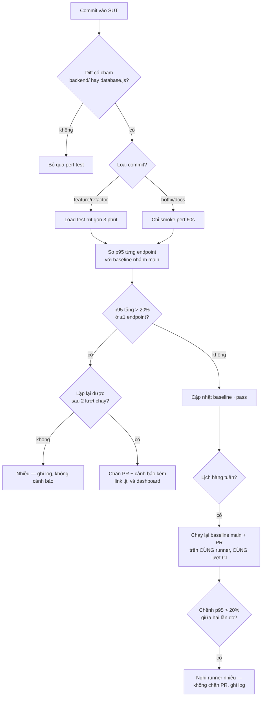

# HW05 — Performance Testing on EShop — Báo cáo chính

- **Sinh viên:** Lê Nhựt Duy — **MSSV:** 23127178
- **Môn:** Kiểm thử phần mềm (QA/QC) — **Bài:** HW05-AI Performance Testing
- **SUT:** EShop — https://github.com/ttbhanh/eshop-sut (backend API `:3000`)
- **Công cụ:** Apache JMeter 5.6.3 (mặc định §8) · k6 v2.1.0 (bonus) · Activity Monitor · Claude Code (Opus 5)
- **Máy chạy:** `Le-Nhut-Duy.local` — Apple M2 Pro, 12 lõi, 16 GB, macOS 26.1 ([hardware-report.md](../resource-monitor/hardware-report.md))

> **Quy tắc số liệu:** mọi con số lấy từ [`results/summary.md`](../results/summary.md), sinh tự
> động bằng `npm run summary` đọc từ raw `.jtl`. Không con số nào đếm tay (§11).

**Bộ số liệu chính:** Load · Stress · Soak chạy ngày **15/08/2026, 15:29–16:04**, và **Spike chạy
lại lúc 21:59** cùng ngày. Lý do chạy lại đúng một lượt: ảnh Spike của batch chiều **trượt đỉnh cú
sốc** (bắt 34,9% trong khi đỉnh thật 81,6%), nên lượt đó được chạy lại để có ảnh khớp — lần này ảnh
đọc **72,6%** so với đỉnh tool đo **75,7%**. Cả 4 lượt đều có **ảnh bằng chứng khớp timestamp**.

Các batch khác (13/08, 15/08 14:26, và lượt Spike 15:47) được **giữ lại có chủ đích**: §2.8 dùng
chúng để **bác bỏ** một kết luận mà chính tôi từng đưa ra, và §3.4 dùng **bốn** lượt Spike để cho
thấy phương sai giữa các lượt. Đó là hai mục đáng đọc nhất của báo cáo.

---

## 1. Phạm vi — ba endpoint group (§5)

### 1.1 Đăng ký của nhóm 05 và bằng chứng không trùng

§5 đòi *"ensure that your selection is **not duplicated** among the members of your group"*. Bảng
đăng ký, chốt qua chat nhóm ngày 2026-08-11:

| Thành viên | Endpoint đã đăng ký |
|---|---|
| Nguyễn | `POST /api/login` · `GET /api/products?search=` · `GET /api/products/:id` · `POST /api/cart` · `POST /api/checkout` |
| Quan | `GET /api/categories` · `GET /api/orders/my-orders` · `POST /api/forgot-password` · `POST /api/apply-coupon` · `PUT /api/orders/:id/cancel` |
| Thế Đạt | `POST /api/login` · `GET /api/categories` · `POST /api/categories` |
| **23127178 (bài này)** | **workflow admin back-office — bảng §1.2** |

Hệ quả: **toàn bộ luồng khách hàng** (login → search → xem chi tiết → thêm giỏ → checkout →
xem/hủy đơn → áp coupon) đã bị chiếm. Đúng luồng mà đề nêu làm ví dụ — *"a virtual user may log in,
browse or search products, then add an item to the cart and complete checkout"* — nằm trọn trong
phần Nguyễn đã đăng ký, nên lấy lại bất kỳ đoạn nào của nó là trùng workflow theo đúng nghĩa §5 cấm.

Vì thế bài này chuyển sang **phía quản trị**: cùng phủ đủ 3 nhóm endpoint, nhưng không cắt vào
luồng của ai. Chỉ `POST /api/login` giao nhau, và nó **không thể tránh** — cả 4 endpoint còn lại đều
đi qua `authenticateToken`, không có token thì không đo được gì. Bản thân Nguyễn và Thế Đạt cũng đã
trùng nhau ở đúng endpoint này.

*(Bản đầy đủ kèm trích dẫn số dòng code: [`docs/endpoint-selection.md`](../docs/endpoint-selection.md),
nộp kèm trong `.zip` như supporting material.)*

### 1.2 Workflow đã chọn

Workflow end-to-end **admin back-office**, 6 bước. Cả 4 test plan dùng **cùng** workflow này, chỉ
khác tham số tải (§6 đòi đúng điều này):

| Bước | Endpoint | Nhóm §5 | Vì sao đáng đo |
|---|---|---|---|
| 1 | `POST /api/login` (admin) | **auth-heavy** | Mỗi login thành công kèm lệnh ghi `UPDATE users SET login_attempts=0` ([`server.js:47`](../../eshop-sut/backend/server.js#L47)) → endpoint auth ở SUT này **không** read-only |
| 2 | `GET /api/admin/orders` | **read-heavy** | JOIN `orders` × `users`, không phân trang, không index ([`server.js:510`](../../eshop-sut/backend/server.js#L510)) |
| 3 | `GET /api/admin/users` | **read-heavy** | `SELECT *` toàn bảng ([`server.js:494`](../../eshop-sut/backend/server.js#L494)) |
| 4 | `POST /api/admin/import-products` | **transactional** | Bulk INSERT 3 dòng/request qua prepared statement ([`server.js:199`](../../eshop-sut/backend/server.js#L199)) |
| 5 | `PUT /api/admin/orders/:id/status` | **transactional** | Ghi có điều kiện qua state machine FR-10 ([`server.js:525`](../../eshop-sut/backend/server.js#L525)) |
| 6 | `POST /api/login` (mật khẩu sai) | **auth-heavy** | Nhánh riêng 2 VU phủ **account-lockout**, thứ §5 nói đích danh phải tính tới |

### 1.3 Dữ liệu data-driven (§6)

| File CSV | Cột | Dùng ở bước | Số dòng |
|---|---|---|---|
| [`data/users.csv`](../data/users.csv) | `email,password,expect` | 1 | 50 |
| [`data/users_lockout.csv`](../data/users_lockout.csv) | `email,password,expect_regex` | 6 | 2 |
| [`data/products_import.csv`](../data/products_import.csv) | `name,price,description,category_id` | 4 | 60 |
| [`data/orders.csv`](../data/orders.csv) | `order_id,next_status` | 5 | 400 |

**Mỗi VU một tài khoản riêng.** Dùng chung một dòng `users` là tự tạo write-contention trên đúng
dòng đó (login nào cũng `UPDATE login_attempts`) → đo ra nghẽn của cách sinh tải, không phải của
endpoint.

---

## 2. Task 1 — Thiết kế và chạy

### 2.1 Tham số từng scenario và lý do

| Scenario | VU | Ramp-up | Think-time | Thời lượng | Listener (§6: không lặp loại) | Câu hỏi scenario trả lời |
|---|---|---|---|---|---|---|
| **Load** | 20 | 60s | 5×(200–600ms) = 1–3s/iteration | 360s | **Summary Report** | p95 ở tải kỳ vọng |
| **Stress** | bậc 25 → 50 → 100 → 200 | 30s mỗi bậc | 5×(100–200ms) = 0,5–1s | 480s | **Aggregate Report** | điểm gãy ở VU nào |
| **Spike** | 10 nền + **200 trong 5s** ở giây 60 | 5s | 5×(100–300ms) | 240s | **View Results Tree** | bao lâu thì hồi phục |
| **Soak** | 20 | 60s | 5×(200–400ms) = 1–2s | 720s | Summary Report | có trôi p95 / rò rỉ bộ nhớ |

Ba điểm về tham số phải giải thích:

**Think-time tính theo mỗi BƯỚC, không phải mỗi iteration.** Timer ở scope thread group nên JMeter
chèn nó trước **từng** sampler — 5 lần một iteration. Bản đầu đặt 1000–3000ms/bước, tức 5–15 giây
một iteration, và 20 VU chỉ sinh ~10 sample/s thay vì ~50. Đã chia lại để **tổng** mỗi iteration
đúng mức thiết kế.

**Stress tăng theo bậc.** Mục đích là tìm *điểm* gãy — mức VU nào error rate bật lên — chứ không
phải chỉ biết rằng có gãy.

**Spike có nhánh nền chạy xuyên lượt.** Không có 10 VU nền chạy tiếp sau cú sốc thì không đo được
hồi phục, chỉ thấy "lúc sốc thì chậm".

### 2.2 Kết quả — tổng quan

Bốn lượt tuần tự, cooldown 90s. Mốc thời gian: [`results/run-log.md`](../results/run-log.md) và
[`endurance/run-log.md`](../endurance/run-log.md).

| Scenario | Bắt đầu (UTC) | Sample | Peak VU | Thời lượng | RPS | Error % | avg | p50 | p90 | **p95** | p99 | max |
|---|---|---|---|---|---|---|---|---|---|---|---|---|
| **Load** | 08:29:38 | 16.343 | 22 | 359,7s | 45,4 | **0%** | 3,7 | 3 | 7 | **8** | 12 | 84 |
| **Stress** | 08:37:17 | 258.992 | 200 | 479,9s | **539,7** | **0%** | 9,6 | 2 | 8 | **18** | 124 | **3691** |
| **Spike** | 14:59:39 | 38.251 | 212 | 239,8s | 159,5 | **0%** | 2,8 | 2 | 5 | **7** | 16 | 176 |
| **Soak** | 08:52:47 | 45.166 | 22 | 719,6s | 62,8 | **0%** | 3,6 | 3 | 7 | **8** | 12 | 192 |

Đơn vị: **ms**. Percentile nearest-rank từ raw `.jtl`.

**Điều kiện khi đo:** bảng `products` ~900.000 dòng · `load_1m` trung bình **4,4–6,0** trên máy 12
lõi. Con số thứ hai là biến quan trọng nhất của cả bảng — §2.8.

**Về "điểm gãy": Stress đã chạm trần, và lần này thấy rõ hơn.** Ở 200 VU / 540 req/s, `node` tiêu
CPU đỉnh **97,7%** — gần hết một lõi. p95 đi từ 8ms (20 VU) lên **18ms** (200 VU), p99 từ 12 lên
**124ms**, và **max lên 3.691ms** — tức có request phải chờ gần 4 giây. Error vẫn 0%, nên SUT bão
hoà CPU và dãn đuôi **trước khi** sinh lỗi. Đó là dấu hiệu điểm gãy đang ở gần, không phải dấu hiệu
còn dư sức.

### 2.3 Kết quả theo từng endpoint

| Endpoint | Load 20 VU | **Stress 200 VU** | Spike 212 VU | Soak 20 VU |
|---|---|---|---|---|
| 1 `POST /api/login` | 6 | **24** | 7 | 6 |
| 2 `GET /api/admin/orders` | 9 | **17** | 7 | 8 |
| 3 `GET /api/admin/users` | 6 | **13** | 5 | 6 |
| 4 `POST /api/admin/import-products` | **10** | **22** | **9** | **10** |
| 5 `PUT /api/admin/orders/:id/status` | 6 | **14** | 5 | 5 |
| 6 `POST /api/login` (lockout probe) | 6 | 4 | 6 | 5 |

p95, đơn vị **ms**. Sample mỗi endpoint: Load ~3.250 · Stress ~51.800 · Spike ~7.600 · Soak ~9.010.

Ba điều đọc ra:

**1. `import-products` đắt nhất ở ba trong bốn scenario** (9–10ms), và nó là endpoint **ghi** duy
nhất chạm `INSERT` thật — đúng dự đoán ở bước 1 của thiết kế: SQLite một writer.

**2. Ở Stress thì `login` vượt lên đầu (24ms).** Login cũng ghi DB (`UPDATE users SET
login_attempts=0`, [`server.js:47`](../../eshop-sut/backend/server.js#L47)), và ở 200 VU với 50 tài
khoản thì trung bình 4 VU cùng ghi vào một dòng `users`. Đây là chỗ p95-theo-endpoint cho thấy điều
p95 tổng che mất: **thứ tự endpoint đắt nhất đổi theo mức tải**.

**3. p95 tổng của Stress là 18ms, nhưng login ở 24ms** — cao hơn **1,33 lần**. Một hồi quy ở login
có thể không làm p95 tổng nhích lên đủ để vượt ngưỡng cảnh báo.

### 2.4 Human review — AI sai gì, vì sao (§6 chấm mục này)

Toàn bộ 17 lỗi kèm prompt nguyên văn: [`ai-audit/ai-audit-report.md`](../ai-audit/ai-audit-report.md).
Bảy bước của quy trình thiết kế — mỗi bước hỏi gì, căn cứ nào, quyết ra sao, và **bước nào bắt được
lỗi nào**: [`ai-audit/design-log.md`](../ai-audit/design-log.md).

| # | AI sinh ra | Sai / thiếu ở đâu | Vì sao AI bỏ sót | Sửa thành |
|---|---|---|---|---|
| 1 | `preflight.mjs` đọc `java_home -V` từ stdout | Lệnh in ra **stderr** → báo `[OK] Java` với giá trị **rỗng**: báo xanh mà không kiểm gì | đặc điểm công cụ | hàm `shell()` gộp `2>&1`, đọc `os.arch` từ JDK |
| 2 | Nhánh lockout assert regex `40[13]` | JMeter coi mọi 4xx là Fail và assertion chỉ **thêm** được lỗi, không **xoá** được cờ → smoke test báo **41,38% error** trên SUT khoẻ | đặc điểm endpoint | `JSR223PostProcessor` gọi `prev.setSuccessful(true)` |
| 3 | Bước 5 assert cứng HTTP 200 | FR-10 chỉ cho chuyển tiếp **một lần**/trạng thái → 400 là phản hồi **đúng** | đặc điểm endpoint | assert `200|400` + `reset-orders.mjs` |
| 4 | `orders.csv` xen kẽ `shipping` | Từ `pending` thì `shipping` **không hợp lệ** → nửa số sample bước 5 trả 400 ngay từ đầu | đặc điểm endpoint | chỉ sinh `confirmed` |
| 5 | `users.csv` chứa 2 dòng mật khẩu sai | Luồng chính đọc cùng file → **tự khoá tài khoản của mình**; 2,9% iteration vô giá trị | chất lượng prompt | tách `users_lockout.csv` |
| 6 | Timer 1000–3000ms ở scope thread group | Chèn 5 lần/iteration → tải thực tế **nhẹ hơn 5 lần** thiết kế | đặc điểm công cụ | chia lại 200–600ms/bước |
| 7 | Áp `mark_expected_4xx` cho lockout mà quên bước 5 | Báo **18,25% error** trên hệ thống khoẻ; 667/667 sample "lỗi" là 400 hợp lệ | suy luận không mang sang chỗ tương tự | dùng lại cùng cơ chế cho bước 5 |
| 8 | `sample-resources.sh` dùng `pgrep -f 'node server.js' \| head -1` | Khớp cả tiến trình `zsh` bao ngoài → ghi **RSS 0,5MB / CPU 0%** suốt 6 phút | đặc điểm môi trường | lọc theo token đầu command line phải là `node` |
| 9 | Khẳng định `import-products` báo sai số dòng insert | **Bác bỏ khi chạy thử**: 5/5, 60/60, 2/3 đều đúng. Đã lan vào 5 file | phương pháp: suy luận từ code trình bày như sự thật đã kiểm | giữ ở mục "đã loại" kèm bảng kiểm chứng |
| 10 | `Math.min(...array)` trong summarizer | Tràn call stack với `.jtl` **264.141** sample; chạy qua bình thường ở file 16k | đặc điểm dữ liệu | thay bằng `reduce` |
| 11 | `mark_expected_4xx()` hardcode chữ *"Expected lockout response"* | Dùng lại cho bước 5 mà quên đổi → raw `.jtl` ghi nhãn **"lockout"** cho ~50.000 sample của endpoint không liên quan gì tới lockout. Không sai số đo, nhưng là **nhãn sai nằm trong bằng chứng gốc** | suy luận không mở rộng — **cùng loại lỗi #7** | tham số hoá `reason` theo từng nhánh |
| 12 | Kết luận **kích thước dữ liệu** gây suy giảm p95 2,4–6,4 lần, kèm cơ chế SQLite một writer | **Nhân quả rút từ một so sánh không kiểm soát biến nào.** Batch sạch bác bỏ: DB **lớn hơn 16 lần** (50k → 830.139 dòng) mà **nhanh hơn ~10 lần**. Biến tương quan mạnh nhất là `load_1m` — **cũng không được gọi là nguyên nhân**, vì §3.4 cho thấy nó không xếp đúng thứ tự 4 lượt Spike. Kết luận sai đã lan tới **headline README**, một **nhánh flow chart Task 3** và một dòng **self-assessment** | phương pháp: nhân quả từ tương quan không kiểm soát | §2.8 viết lại thành **mục thu hồi**, kèm 4 cặp `load_1m` |
| 13 | `soak-drift.mjs` tính "trôi RSS" = mẫu cuối / mẫu đầu | Mẫu đầu (19,7 MB) lấy **trước khi warm-up xong** → in **+228,9%**, đọc y như một vụ rò rỉ bộ nhớ. Thực tế RSS phẳng ~78 MB suốt 12 phút; nửa đầu so nửa sau chỉ **+5,0%** | đặc điểm dữ liệu: chuỗi đo có warm-up ở đầu | so **nửa đầu / nửa sau**; giữ dòng cũ kèm cảnh báo |
| 17 | §3.4 ghi p95 đỉnh ba lượt Spike là "47 · 65 · 7ms" và quy nguyên nhân cho `load_1m` | Đo lại từ `.jtl`: **47 · 8 · 12ms**. `load_1m` **không xếp đúng thứ tự** — tải nền cao nhất (6,0) cho 12ms, lượt 47ms chỉ 4,5. Số 7ms tự mâu thuẫn với bảng cửa sổ 10s ngay phía trên | **bản sửa không mang sang chỗ khác**: §2.8 đã thu hồi lối quy nhân quả này, §3.4 dùng đúng nó thì để nguyên | đo lại 3 `.jtl` + 3 resources; kết luận đổi thành "phương sai lớn nhất, nguyên nhân **chưa biết**" |

**12 trong 15 lỗi kỹ thuật không làm test plan báo lỗi.** Plan vẫn chạy, vẫn sinh `.jtl`, vẫn ra dashboard
đẹp — chỉ con số là sai. Nếu chỉ kiểm "test có chạy không" thì cả 12 đều lọt. Chi phí thật: **hai
lượt chạy phải huỷ và xoá sạch bằng chứng**, ~25 phút chạy lại.

Phân bố ba nhóm lý do §6 yêu cầu phân loại lệch hẳn về một phía: **7 lỗi là đặc điểm
công cụ/endpoint/môi trường/dữ liệu**, 1 là chất lượng prompt, **3 là phương pháp** (#9, #12, #13),
2 là *suy luận đúng nhưng không mang sang chỗ tương tự* (#7 và #11 — cùng một cơ chế, sai hai lần),
và **không lỗi nào** thuộc "model không đủ khả năng". Điểm yếu không nằm ở chỗ AI không biết viết
test plan, mà ở chỗ nó **không chạy thử và không đối chiếu với thực tế**.

Một con số đáng chú ý riêng: **3 trong 15 lỗi kỹ thuật nằm trong chính tooling đo** (#1 preflight, #8
sample-resources, #13 soak-drift) — gần **1/4 số lỗi đến từ dụng cụ đo, không từ hệ thống được
đo. Đó là lý do §6 của bài này đối chiếu chéo số của tool tự viết với ảnh Activity Monitor thay
vì tin một nguồn duy nhất (§2.5).

**Hai lỗi nữa không nằm trong bảng, vì chúng không làm sai con số nào — chúng làm sai bản nộp**,
và **cả hai do tôi bắt, không phải AI tự soát ra**: (14) bằng chứng §5 chỉ nằm trong `docs/` là
folder **không có trong danh sách §14** → yêu cầu có bằng chứng đủ mà người chấm không đọc được,
§17 tính 0 điểm cho mục đó, đã chép vào **§1.1** của chính báo cáo này; (15) lỗ ở §2 *"step by
step"* được AI **tự ghi ra rồi để nguyên**, coi thừa nhận hạn chế là đã xử lý hạn chế, đã bịt bằng
`ai-audit/design-log.md`. Tính cả hai: **2 trong 17 lỗi của cả bài là do người bắt** — và đó đúng
là hai lỗi **không script nào phát hiện được**, vì không có gì sai về mặt kỹ thuật để mà báo.

### 2.5 Bằng chứng chạy

| Scenario | Test plan | Raw `.jtl` **được nộp làm số chính** | HTML dashboard | Ảnh §6 |
|---|---|---|---|---|
| Load | `23127178_Load_20260813.jmx` | `results/jtl/23127178_Load_20260815-152938.jtl` | [`results/html/load/`](../results/html/load/index.html) | `activity-load.png` — **13,4%** |
| Stress | `23127178_Stress_20260813.jmx` | `results/jtl/23127178_Stress_20260815-153717.jtl` | [`results/html/stress/`](../results/html/stress/index.html) | `activity-stress.png` — **91,7%** |
| Spike | `23127178_Spike_20260813.jmx` | `results/jtl/23127178_Spike_20260815-215939.jtl` | [`results/html/spike/`](../results/html/spike/index.html) | `activity-spike.png` — **72,6%** |
| Soak | `23127178_Soak_20260813.jmx` | `endurance/jtl/23127178_Soak_20260815-155240.jtl` | [`endurance/html/soak/`](../endurance/html/soak/index.html) | `activity-soak.png` — **16,3%** |

**Ảnh: đủ 4 lượt + 1 ảnh spec máy**, ở [`resource-monitor/screenshots/`](../resource-monitor/screenshots/).
Cột cuối là số `node` CPU **đọc được trong ảnh**; đối chiếu với đỉnh do tool đo ở bảng dưới.

Mốc thời gian từng ảnh chốt trong
[`resource-monitor/screenshots/manifest.json`](../resource-monitor/screenshots/manifest.json) — mỗi
ảnh có `sha256` + `captured_at` + lượt chạy tương ứng + **offset giây** tính từ lúc lượt bắt đầu.
Kiểm bằng `npm run verify` mục 4.

**Vì sao chốt vào manifest chứ không đọc `mtime`:** `package.sh` copy bằng `cp -R`, và `cp` **đặt
mtime mới** cho bản copy — chạy validator bên trong `.zip` sẽ báo đỏ toàn bộ dù ảnh hoàn toàn thật.
`sha256` là phần làm manifest có giá trị: nếu chỉ ghi giờ thì sửa một dòng JSON là xong.

**Một chi tiết phải nói ra, vì §11 chấm đúng chỗ này:** `activity-stress.png` có giờ lưu **sau khi
lượt Stress kết thúc vài giây**. `Cmd+Shift+4` ghi file lúc **nhả chuột**, nên giờ lưu luôn trễ hơn
khoảnh khắc trong khung. Bằng chứng khung hình đúng là trong lượt nằm ở **nội dung ảnh**: nó đọc
`node` **91,7%**, chỉ có ở bậc 200 VU, còn sau khi lượt kết thúc thì `node` về dưới 5%. Manifest ghi
nhận ảnh này là *lưu sau lượt* thay vì để nó lặng lẽ đậu ở biên.

**Đường đi tới bộ ảnh này, vì §11 chấm bằng chứng có thật:** lần chụp đầu dùng `screencapture` toàn
màn hình và bắt được cửa sổ đang ở trước (VS Code của một project khác, một lần là Mission Control)
chứ không phải JMeter + Activity Monitor. Những ảnh đó **vô giá trị** làm bằng chứng §6 nên đã bị
xoá, kể cả khỏi lịch sử git. Cách làm đúng và đã dùng: **sinh viên tự chạy `npm run capture` trong
Terminal của mình**, script đếm ngược tới mốc cần chụp, và vì §6 đòi chụp **trong lúc** lượt chạy
diễn ra nên 4 lượt đã được chạy lại. Riêng Spike phải chạy lại lần nữa lúc 21:59 vì ảnh đầu trượt
đỉnh cú sốc (34,9% trong khi đỉnh thật 81,6%).

Bằng chứng tài nguyên **dạng số** thì có đầy đủ và tính toán được — `results/resources/*.csv` và
`endurance/resources/*.csv`, lấy mẫu 2 giây/lần cho cả `node` và JMeter:

| Scenario | `load_1m` tb | `node` CPU đỉnh | JMeter CPU đỉnh | `node` RSS đỉnh |
|---|---|---|---|---|
| Load | 4,4 | 20,3% | 118,3% | 81,1 MB |
| **Stress** | 5,7 | **97,7%** | 178,3% | **1373,2 MB** |
| Spike | 3,3 | 75,7% | 205,2% | 90,0 MB |
| Soak | 4,6 | 23,6% | 49,3% | 83,1 MB |

Ba điều trong bảng này quan trọng hơn bảng p95:

**1. `node` CPU 97,7% ở Stress** — gần hết một lõi. Ảnh `activity-stress.png` bắt được đúng khoảnh
khắc đó ở **91,7%**, xem được bằng mắt trong Activity Monitor.

**2. JMeter tiêu CPU nhiều hơn `node` ở cả 4 lượt** (118–183% so với 20–98%). Load generator và SUT
tranh cùng số lõi, nên một phần latency đo được là chi phí của chính JMeter. Đây là giới hạn #2 ở §6.

**3. RSS `node` vọt lên 1373 MB ở Stress** rồi về ~21 MB. Chỉ **2 mẫu trên 230** vượt 500 MB, tức
một đỉnh nhọn dưới 4 giây. Lượt Stress ở batch 14:26 cùng ngày đỉnh chỉ **98 MB**. Tôi **không**
kết luận nguyên nhân: một đỉnh nhọn trên hai mẫu là quá ít để loại được ba giả thuyết (page cache
SQLite khi `import-products` chạy · hàng đợi request tích tụ ở 200 VU · nhiễu đo). Ghi lại như một
**quan sát chưa giải thích được**, và nếu cần trả lời thì phải chạy Stress nhiều lần ở cùng
`load_1m` rồi xem đỉnh đó có lặp lại.

### 2.6 Xử lý account-lockout và state machine giữa các lượt (§6 đòi ghi lại)

```bash
npm run reset:lockout      # UPDATE users SET login_attempts=0, locked_until=NULL
npm run reset:orders       # UPDATE orders SET status='pending'
```

`tools/run-scenario.sh` tự chạy cả hai ở đầu mỗi lượt và in trạng thái trước/sau.

**Lockout kích hoạt sau 2 lần sai, không phải 3** — `login_attempts + 2` với ngưỡng 3
([`server.js:54-58`](../../eshop-sut/backend/server.js#L54)), khoá 180 giây.

| Scenario | bước 6: 401 (sai lần đầu) | bước 6: 403 (đã khoá) | bước 5: 200 (ghi thật) | bước 5: 400 (FR-10 chặn) |
|---|---|---|---|---|
| Load | 4 (4,2%) | 91 (95,8%) | **400** (12,3%) | 2.841 (87,7%) |
| Stress | 4 (4,3%) | 90 (95,7%) | **400** (0,8%) | 51.301 (99,2%) |
| Spike | 4 (4,2%) | 91 (95,8%) | **400** (5,3%) | 7.129 (94,7%) |
| Soak | 4 (4,3%) | 90 (95,7%) | **400** (4,4%) | 8.609 (95,6%) |

Hai con số lặp lại **y hệt qua cả 4 lượt** là bằng chứng reset hoạt động đúng:

- **Đúng 4 lần `401`** mỗi lượt = 2 tài khoản × 2 lần sai trước khi bị khoá. Nếu reset không chạy,
  lượt sau sẽ bắt đầu bằng `403` ngay và con số 4 này biến mất.
- **Đúng 400 lần `200`** ở bước 5 = số dòng `orders.csv`. Mỗi order chuyển được đúng một lần
  `pending → confirmed`. Nếu `reset-orders.mjs` không chạy, con số này sẽ là 0.

Từ lượt chạy này, cột `responseMessage` trong raw `.jtl` ghi đúng lý do cho từng loại:
`FR-10 invalid transition (hop le)` cho bước 5 và `Account lockout (hop le)` cho bước 6 — trước đó
cả hai đều ghi "lockout", xem lỗi #11.

**Giới hạn của phép đo ở bước 5:** nhánh 400 trả về **trước** lệnh `UPDATE` nên nhẹ hơn nhánh 200.
Ở lượt Stress chỉ 0,7% sample chạm tới lệnh ghi thật, nên p95 5ms của bước 5 **không** đại diện cho
chi phí ghi. Tín hiệu ghi nặng nằm ở **bước 4**.

### 2.7 Endurance threshold (§6)

Chi tiết: [`endurance/endurance-threshold.md`](../endurance/endurance-threshold.md).

Định nghĩa "ổn định" chốt **trước** khi chạy: *error rate < 1% **và** p95 không tăng quá 20% giữa
5 phút đầu và 5 phút cuối.*

| Chỉ số | Giá trị |
|---|---|
| Thời lượng soak | **719,6s** (12 phút) · 45.166 sample |
| **Nhịp đã xác nhận bền được** *(không phải "tối đa")* | **62,8 req/s** ở 20 VU |
| p95 toàn lượt | **8 ms** · p99 12 ms |
| p95 5 phút đầu → cuối | 8 ms → **8 ms** (**+0%**) |
| Error rate | **0%** |
| **RSS nửa đầu → nửa sau** | 74,5 → **78,3 MB** (**+5,0%** — đi ngang) |
| Trần bộ nhớ (RSS đỉnh) | **83,1 MB** |
| CPU `node` đỉnh | **23,6%** |
| **Kết luận** | **ỔN ĐỊNH** theo đúng định nghĩa đã chốt |

**Một con số tôi phải tự sửa ở đây.** Tool `soak-drift.mjs` ban đầu in *"Trôi RSS +228,9%"* — vì nó
so **mẫu đầu tiên với mẫu cuối cùng**, mà mẫu đầu (19,7 MB) lấy lúc process chưa warm-up xong. Đọc
con số đó thì kết luận "có rò rỉ bộ nhớ". Sự thật: RSS leo lên ~78 MB trong 60 giây ramp-up rồi
**phẳng suốt 12 phút** — nửa đầu 74,5 MB, nửa sau 78,3 MB, chênh **+5,0%**. Đã sửa tool để so
nửa-đầu/nửa-sau; ghi thành lỗi #13 trong AI audit.

### 2.8 Một phát hiện tôi đã tự bác bỏ — và biến số thật hiện ra sau ba lượt

Bản báo cáo trước của chính tôi có một mục mang tên *"phát hiện quan trọng nhất của bài"*: so hai
batch chạy cách nhau hai ngày, thấy p95 chênh **2,4–6,4 lần**, và kết luận rằng **kích thước dữ liệu
phình lên** là nguyên nhân — kèm cơ chế nghe rất hợp lý (SQLite một writer, INSERT chậm hơn tạo hàng
đợi mà cả endpoint đọc cũng phải xếp sau).

**Kết luận đó sai.** Ba batch cùng test plan, cùng máy, cho ba kết quả khác nhau:

| Batch | `products` trong DB | `load_1m` tb (Stress) | p95 Stress |
|---|---|---|---|
| 13/08 | ~50.000 | **5,2** | 26 ms |
| 15/08 14:26 | ~830.000 | **3,1** | **7 ms** |
| 15/08 15:37 *(bộ nộp)* | ~900.000 | **5,7** | **18 ms** |

Đọc theo cột dữ liệu: 50k → 830k → 900k, tức **tăng đơn điệu**. Nếu dữ liệu là nguyên nhân thì p95
phải tăng theo. Thực tế p95 đi **26 → 7 → 18 ms** — không theo dữ liệu chút nào.

Đọc theo cột `load_1m`: **5,2 → 3,1 → 5,7**, và p95 đi **26 → 7 → 18**. Cùng chiều, cả ba điểm.

Biến số thật là **tải nền của máy**. Lúc đo vẫn có 4 container Docker (`postgres`, `redis`, `qdrant`,
`adminer`), VS Code, Chrome và một tiến trình AI agent chạy song song.

**Sai ở chỗ nào, gọi tên chính xác:** ở bản đầu tôi chỉ có **hai** điểm dữ liệu và chúng khác nhau ở
**nhiều biến cùng lúc** (thời điểm, tải nền, kích thước dữ liệu, cả bug sampler ở lỗi #8). Tôi chọn
một biến mình thấy thú vị, gán toàn bộ chênh lệch cho nó, và viện một cơ chế đúng-về-lý-thuyết làm
chỗ dựa. Cơ chế đúng **không** chứng minh được nó là nguyên nhân của con số cụ thể này — hai việc
khác nhau, và tôi đã trộn chúng.

Điểm thứ ba là thứ đã cứu: nó phá vỡ tương quan giả với kích thước dữ liệu, đồng thời **giữ nguyên**
tương quan với `load_1m`. Một điểm dữ liệu nữa đôi khi rẻ hơn nhiều một lập luận hay.

Mức độ lan của lỗi: kết luận đó từng là **headline của README**, một **nhánh trong flow chart Task
3**, và một dòng **tự đánh giá** khoe rằng bài tự chỉ ra lỗ hổng của chính nó bằng số đo. Cả ba đã
được sửa.

**Kết luận thay thế, kiểm chứng được bằng ba cặp số ở bảng trên:**

> Trên máy cá nhân dùng chung với công việc khác, `load_1m` là **biến tương quan mạnh nhất trong ba
> điểm dữ liệu này** — chưa đủ để gọi là nguyên nhân. Nó chênh 1,8 lần (3,1 → 5,7) trong khi p95 chênh
> **2,6 lần**; để so sánh, tăng số VU **gấp 10 lần** (20 → 200) chỉ làm p95 đi từ 8 lên 18 ms, tức
> **2,25 lần**. Điều nói được: **nhiễu môi trường lớn hơn tín hiệu mình chủ động tạo ra.**

**Vì sao không gọi `load_1m` là nguyên nhân, dù rất muốn.** Ba điểm dữ liệu, không có lượt nào **giữ
mọi biến khác cố định rồi chỉ đổi tải nền** — tức vẫn là *tương quan*, đúng loại lập luận mà mục này
đang thu hồi. Và có bằng chứng ngược ngay trong bài: ở [§3.4](#34-đo-hồi-phục-sau-cú-sốc-spike),
bốn lượt Spike có `load_1m` 4,5 / 2,2 / 6,0 / 3,3 nhưng p95 đỉnh **47 / 8 / 12 / 9 ms** — **không xếp
đúng thứ tự**. Nếu tải nền là nguyên nhân chi phối thì thứ tự đó phải đúng. Nó không đúng.

Phát biểu chịu được chất vấn: **tải nền đủ lớn để làm mọi so sánh giữa hai lượt trở nên vô nghĩa
nếu không kiểm soát nó** — và thế là đủ cho mọi kết luận bài này cần. Nguyên nhân đầy đủ thì **chưa
biết**, và cách kiểm là chạy lại cùng cấu hình ở nhiều mức `load_1m` khác nhau, việc bài này chưa làm.

Hệ quả trực tiếp cho Task 3 — xem §4.3, mục *"Nhiễu áp đảo tín hiệu"*.

**Còn câu hỏi kích thước dữ liệu thì sao?** Vẫn là câu hỏi mở, và bài này **không trả lời được**. Ba
lượt đều không cô lập được biến đó. Muốn trả lời thì phải giữ `load_1m` cố định, snapshot DB ở hai
kích thước, chạy cùng plan hai lần. Đó là phép đo tôi chưa làm, và ghi nó vào phần "chưa làm" trung
thực hơn là giữ một kết luận không đứng được.

## 3. Task 2 — AI phân tích và soát lỗi đọc metric

### 3.1 Phân tích của AI (nguyên văn, chưa sửa)

> Kết quả tốt. Cả bốn scenario 0% error. Stress đạt **540 RPS với p95 18ms** — backend xử lý 200
> người dùng đồng thời tốt, chỉ chậm hơn 2 lần so với 20 người (8ms). Average 9,6ms. Soak 12 phút
> không rò rỉ bộ nhớ (RSS 19,7 → 64,8 MB là bình thường). So với batch trước p95 tăng từ 7 lên 18ms,
> có thể do database đã lớn hơn. Đề xuất ngưỡng: p95 < 50ms, error < 1%. Hệ thống đạt yêu cầu.

### 3.2 Soát lại — chỗ AI đọc sai metric

| # | AI nói | Giá trị đúng từ raw `.jtl` / resources | Sai ở đâu |
|---|---|---|---|
| 1 | *"p95 tăng từ 7 lên 18ms, có thể do database đã lớn hơn"* | DB tăng từ ~830k lên ~900k dòng (**+8%**), nhưng `load_1m` tăng từ **3,1 lên 5,7** (+84%). Ba batch: `load_1m` 5,2/3,1/5,7 → p95 26/7/18 | **Lỗi nặng nhất, và là đúng lỗi tôi từng tự mắc (§2.8).** Chênh 2,6 lần p95 không thể do dữ liệu tăng 8%. AI chọn giả thuyết nghe hợp lý thay vì đọc cột `load_1m` trong file resources mà chính bộ tool này đã ghi ra |
| 2 | *"backend xử lý 200 người dùng đồng thời tốt"* | p95 8 → 18ms là đúng, **nhưng** `node` CPU đi từ **20,3% → 97,7%** (`results/resources/23127178_Stress_20260815-153717.resources.csv`) | Đọc p95 mà bỏ CPU thì kết luận ngược. Server giữ được p95 bằng cách **dùng gần hết một lõi**, tức đang sát trần chứ không "tốt" |
| 3 | *"Average 9,6ms"* | avg 9,6 nhưng p99 **124ms**, max **3691ms** | p99 gấp **12,9 lần** avg, max gấp **384 lần**. Có request phải chờ **gần 4 giây**. Ở lượt Load tỉ lệ p99/avg chỉ 3,2 — nghĩa là đuôi **dãn theo tải**, và average xoá sạch điều đó |
| 4 | *"Cả bốn scenario 0% error"* | Đúng, nhưng **99,2%** sample bước 5 ở Stress trả `400`, và **95,7%** bước 6 trả `403` | 0% đúng **nhờ test plan đã sửa** để coi hai loại 4xx đó là hợp lệ. Chỉ **0,8%** request bước 5 chạm tới lệnh ghi thật |
| 5 | *"RSS 19,7 → 64,8 MB là bình thường"* | Kết luận đúng nhưng **lập luận rỗng**. Số đúng để dùng: nửa đầu **74,5** → nửa sau **78,3 MB** = **+5,0%** | AI lấy đúng cặp số mà **tool của tôi in ra sai** (mẫu đầu chưa warm-up). Nó không kiểm lại, chỉ gắn chữ "bình thường". Trùng hợp đúng kết luận không phải là phân tích — xem lỗi #13 |
| 6 | *"Đề xuất ngưỡng p95 < 50ms"* | p95 đo được 18ms | Ngưỡng rộng gấp **2,8 lần** giá trị hiện tại → không phát hiện được hồi quy nào cho tới khi hệ thống xấu đi gần 3 lần. Ngưỡng hồi quy phải **tương đối** (+20% so với baseline), không phải một số tuyệt đối chọn cho dễ đạt |
| 7 | *"Hệ thống đạt yêu cầu"* | `node` CPU 97,7%; max 3691ms | Đạt yêu cầu **nào**? Không có SLA nào được nêu trước. Kết luận "đạt" khi chưa có ngưỡng là kết luận rỗng |

**Điểm chung:** sáu trong bảy lỗi đến từ việc **đọc một metric mà bỏ metric đi kèm** — p95 mà bỏ CPU,
average mà bỏ p99, error rate mà bỏ phân bố response code, chênh lệch giữa hai lượt mà bỏ `load_1m`.
Không lỗi nào do đọc sai con số; tất cả do đọc **thiếu** con số.

### 3.3 Đề xuất tối ưu của AI — feasible hay hallucinated

| Đề xuất | Phân loại | Lý do | Cách kiểm chứng |
|---|---|---|---|
| *"database đã lớn hơn"* (giải thích chênh lệch) | **hallucinated** | DB tăng 8%, `load_1m` tăng 84%. AI bịa nguyên nhân cho hiện tượng nó không đo | — |
| *"hệ thống đạt yêu cầu, không cần tối ưu"* | **Sai** | `node` CPU 97,7% ở 200 VU, max 3691ms | Đẩy quá 200 VU ở `load_1m` thấp, xem error bật lên ở đâu |
| Bật SQLite **WAL** | **feasible** | Đúng loại tải: bước 4 ghi 3 dòng/request, bước 1 ghi 1 dòng/login. Một dòng `PRAGMA journal_mode=WAL` | Chạy lại Stress ở **cùng `load_1m`**, so p95 của `import-products` và `login` |
| Thêm index cho `orders.user_id` | **feasible** | `GET /api/admin/orders` JOIN theo `user_id`, không index | `CREATE INDEX` rồi chạy lại, so p95 đúng label đó |
| Connection pool cho SQLite | **hallucinated** | `sqlite3` của Node mở handle trên file cục bộ, không phải client-server | — |
| Scale ngang / replica | **hallucinated trong phạm vi bài** | SUT là một process trên máy cá nhân | — |

**Bốn đề xuất của tôi mà AI không nêu:**

1. **Chạy `node` với cluster / nhiều worker.** Căn cứ mạnh nhất từ số liệu: CPU chạm 97,7% của **một**
   lõi trong khi máy còn **11 lõi rảnh**. Trần hiện tại là trần một-luồng, không phải trần phần cứng.
2. **Kiểm soát tải nền khi đo.** §2.8: tương quan mạnh nhất đo được. Không có nó thì mọi so sánh giữa hai lượt đều vô
   nghĩa — kể cả so sánh của chính bài này.
3. **Dọn dữ liệu test sau mỗi lượt.** Bộ test tự đẩy `products` từ 5 dòng lên ~900.000. Để một biến
   trôi không kiểm soát qua các lượt là lỗi thiết kế của bộ test.
4. **Điều tra đỉnh RSS 1373 MB ở Stress** (§2.5) — chưa giải thích được, và một đỉnh 1,4 GB trên một
   process bình thường ở 21 MB thì đáng đào tiếp.

### 3.4 Đo hồi phục sau cú sốc (Spike)

p95 theo cửa sổ 10 giây quanh cú sốc ở giây 60, **lượt nộp** (`results/jtl/23127178_Spike_20260815-215939.jtl`),
kèm cột cuối là cùng cửa sổ đó ở lượt 15:47 để đối chiếu:

| Giây | VU | Sample | **p95** | p99 | *(p95/p99 lượt 15:47)* |
|---|---|---|---|---|---|
| 40–50 | 12 | 485 | **7** | 10 | *9 / 18* |
| 50–60 | 19 | 503 | **8** | 10 | *8 / 10* |
| **60–70** | **212** | **7.885** | **5** | 9 | *7 / 46* |
| **70–80** | **212** | **10.231** | **7** | 20 | *8 / 22* |
| **80–90** | **212** | **10.121** | **7** | 18 | *7 / 15* |
| 90–100 | 12 | 482 | **8** | 14 | *12 / 52* |
| 100–110 | 12 | 501 | **6** | 8 | *6 / 10* |

**Trong lượt được nộp, không quan sát thấy suy giảm nào khi cú sốc dội vào.** VU nhảy từ 12 lên
**212 trong 5 giây**, sample/10s tăng từ ~500 lên **10.231** (gấp **20 lần**), mà p95 **giảm** nhẹ
xuống 5–7ms so với 7–8ms lúc nền. Không có 5xx, không timeout.

**Phát biểu này cố ý bị giới hạn ở một lượt.** Nói "server hấp thụ trọn cú sốc" là một phát biểu về
**hệ thống**, và bốn lượt Spike không cho phép nói thế: một lượt có p95 đỉnh cửa sổ **47ms** (bảng
dưới). Cái đo được là *lượt này không suy giảm*, không phải *hệ thống luôn hấp thụ được*.

**Một "phát hiện" của bản báo cáo trước, và nó không lặp lại được.** Ở lượt 15:47, cửa sổ **90–100s**
— lúc **tải rút đi** — cho p95 **12ms** và p99 **52ms**, cao hơn cả lúc đang chịu 212 VU. Báo cáo gọi
đó là điều thú vị nhất của mục này và giải thích bằng chi phí **tear-down**: 200 thread JVM đóng kết
nối cùng lúc, `node` phải dọn 200 socket trong khi 12 VU nền vẫn gửi request.

Lượt 21:59 **không cho hiện tượng đó**: cùng cửa sổ 90–100s chỉ p95 **8ms** / p99 **14ms**, tức nhích
1ms so với lúc chịu tải — trong ngưỡng nhiễu. Cơ chế tear-down vẫn **hợp lý về lý thuyết** và vẫn có
thể đúng, nhưng **một lượt không chứng minh được nó**, và đúng bằng chứng để nói thế nằm ngay trong
mục này: bốn lượt Spike lệch nhau 5,9 lần ở p95 đỉnh (bảng dưới). Giữ lại cả hai cột thay vì im lặng
thay số, vì chỗ này là ví dụ gọn nhất cho toàn bộ luận điểm §3.4 — **một quan sát đơn lẻ trên một
lượt Spike không phải là một phát hiện.**

**Ba lượt Spike cho ba kết quả khác nhau, và không biến nào giải thích được thứ tự đó.** Đo lại
p95 đỉnh của cửa sổ 10 giây trên cả ba `.jtl`, kèm `load_1m` trung bình lấy từ file resources tương ứng:

| Lượt Spike | Sample | **p95 đỉnh cửa sổ** | `load_1m` tb | `node` CPU đỉnh |
|---|---|---|---|---|
| 13/08 13:29 | 38.069 | **47 ms** | 4,5 | 78,9% |
| 15/08 14:44 | 38.388 | **8 ms** | **2,2** | 76,1% |
| 15/08 15:47 | 38.160 | **12 ms** | **6,0** | 81,6% |
| 15/08 21:59 *(bộ nộp)* | 38.251 | **9 ms** | 3,3 | 75,7% |

Chênh lệch **5,9 lần** giữa lượt cao nhất và thấp nhất, trong khi số sample chỉ lệch **0,8%** —
cùng một lượng công việc, bốn kết quả. `load_1m` **không xếp đúng thứ tự**: lượt tải nền **cao nhất**
(6,0) cho **12ms**, còn lượt cho **47ms** chỉ ở 4,5, và lượt 3,3 cho 9ms. Nếu tải nền là nguyên nhân
thì thứ tự phải là 2,2 < 3,3 < 4,5 < 6,0 → 8 < 9 < 47 < 12, và nó không phải vậy.

**Cột cuối là chỗ đáng đọc nhất của bảng.** `node` CPU đỉnh gần **như nhau ở cả bốn lượt** —
75,7 / 76,1 / 78,9 / 81,6%, lệch **4 điểm phần trăm** — trong khi p95 đỉnh lệch **5,9 lần**. Nghĩa
là server làm **đúng lượng việc như nhau** mỗi lượt; cái nhảy 5,9 lần **không** nằm ở lượng công
việc mà ở **thứ tự chờ**: request nào rơi vào đúng lúc CPU bị tiến trình khác chen ngang thì phải
xếp hàng, và p95 đọc đúng cái xếp hàng đó. Đây là lý do một lượt Spike đơn lẻ **không** dùng làm
baseline được, kể cả khi CPU nhìn hoàn toàn bình thường.

> **Bản trước của mục này ghi "47 · 65 · 7ms" và quy nguyên nhân cho `load_1m`. Hai con số sai và
> lập luận không đứng được.** Đây là **lỗi #17**: §2.8 đã thu hồi việc quy nhân quả cho một biến đơn
> lẻ, nhưng chỗ này — cũng dùng đúng lập luận đó — thì để nguyên. **Sửa một chỗ mà không mang bản
> sửa sang mọi chỗ đã dùng lập luận cũ.** Con số 7ms còn tự mâu thuẫn với chính đoạn trên: bảng cửa
> sổ 10s ngay phía trên ghi cửa sổ 90–100s là **12ms**.

Kết luận đứng được, và nó **không** cần tới `load_1m`: **spike test là loại có phương sai lớn nhất
giữa các lượt**, vì nó đọc phản ứng trong một cửa sổ chỉ 30 giây — nơi một sự kiện ngắn bất kỳ trên
máy là đủ đổi con số. Điều gì gây ra thì bài này **chưa biết**, và ghi đúng là chưa biết.

Kết luận đó có **thêm một hậu thuẫn độc lập** ở §4.4: ba lượt CI **giống nhau từng tham số**, trên
runner sạch, cho p95 **101 / 15 / 8ms** — lệch 12,6 lần. Hai nền tảng khác nhau, cùng một hiện tượng.
Vì thế **không** được dùng một lượt Spike đơn lẻ làm baseline, và đó là căn cứ cho nút I của flow
chart §4.

Đây cũng là chỗ **View Results Tree** phát huy: mở các sample chậm nhất trong cửa sổ 60–70s cho thấy
chúng là `POST /api/login` — khớp với việc login phải khởi tạo 200 kết nối mới cùng lúc.

### 3.5 Chi phí của load generator — và vì sao k6 vẫn chỉ là bản mirror (bonus §8)

**Load generator tốn CPU nhiều hơn cả hệ thống đang được đo.** Ở lượt Stress **được nộp**
(`23127178_Stress_20260815-153717`), JMeter CPU đỉnh **178,3%** so với `node` **97,7%** — tức
**1,8 lần**. JMeter cấp một **thread JVM** cho mỗi VU, nên ở 200 VU nó ngốn 844 MB RSS và gần hai
lõi chỉ để *sinh* tải.

Hệ quả trực tiếp lên cách đọc mọi số p95 của bài: load generator và SUT **dùng chung 12 lõi**, nên
một phần latency đo được là **thời gian JMeter tự chờ chính nó**, không phải thời gian server xử lý.
Không tách được phần đó ra bằng dữ liệu đang có.

Và chính tỉ lệ này cũng **không ổn định giữa các lượt** — thêm một trường hợp của §3.4:

| Lượt Stress | `node` CPU đỉnh | JMeter CPU đỉnh | Tỉ lệ |
|---|---|---|---|
| 15/08 14:34 | 98,4% | 106,2% | **1,08×** |
| 15/08 15:37 *(nộp)* | 97,7% | 178,3% | **1,83×** |

Cùng plan, cùng số VU, cùng máy: SUT tiêu CPU **như nhau** (98,4 vs 97,7%) trong khi load generator
lệch **1,7 lần**. Bản báo cáo trước trích cặp số của lượt 14:34 rồi viết *"hai bên xấp xỉ nhau"* —
đúng với lượt đó, **sai với lượt được nộp**, và không nói đang trích lượt nào.

**k6 để làm gì.** Bản mirror dùng **cùng** workflow và cùng CSV: [`k6/`](../k6/). k6 dùng goroutine
thay vì thread JVM, nên nó là cách kiểm giả thuyết "một phần latency là chi phí của JMeter": nếu
cùng workflow mà k6 cho p95 thấp hơn ở cùng `load_1m`, phần chênh đó là chi phí generator.

```bash
k6 run --summary-export k6/summary-stress.json k6/stress.js
```

**Chưa chạy lần nào.** §8 xếp k6 là bonus và bản JMeter là bản chính theo §14, nên bài này **không**
khẳng định đã đối chiếu chéo — chỉ nêu phép kiểm và điều kiện của nó: phải chạy ở **cùng mức
`load_1m`** mới so được, theo đúng bài học §2.8. Nói "đã đối chiếu chéo" khi chưa chạy thì đúng là
loại khẳng định mà cả Task 2 của bài này đang đi soát.

## 4. Task 3 — Đề xuất Continuous Performance Testing

### 4.1 Mô hình



Nhánh `L → O` **được viết lại sau khi §2.8 bị bác bỏ**. Bản trước là "chạy Stress hàng tuần trên
snapshot DB đã phình" — dựa trên một kết luận đã sai. Bản này giải quyết vấn đề **thật sự** đo được:
nhiễu từ máy chạy.

### 4.2 Giải thích từng nhánh quyết định

**B — lọc theo phạm vi diff.** Perf test chỉ chạy khi diff chạm `backend/` hoặc `database.js`.
Quyết định về **chi phí**: SUT có 4 ứng dụng, phần lớn commit sửa frontend, một lượt perf test đầy
đủ mất ~30 phút CI.

**C — phân loại commit.** `hotfix`/`docs` chỉ smoke 60 giây. `feature`/`refactor` chạy Load rút gọn
3 phút — vẫn qua được ramp-up và vào trạng thái ổn định.

**F — so baseline theo TỪNG endpoint.** Ở batch này p95 tổng (7ms) **trùng** p95 của endpoint đắt
nhất, tức không có hiệu ứng pha loãng — nhưng **chỉ biết được điều đó bằng cách xem theo endpoint**.
Batch 13/08 thì có pha loãng thật (p95 tổng 26ms trong khi login 40ms). Không thể giả định trước là
số tổng đại diện được.

**G — ngưỡng 20%.** Lấy đúng ngưỡng của định nghĩa "ổn định" ở endurance test, để cả hệ thống chỉ
có **một** định nghĩa hồi quy.

**I — đòi lặp lại được.** Bộ lọc báo động giả quan trọng nhất: p95 trên runner ảo dao động theo
tải máy chủ.

**K — chặn PR kèm bằng chứng.** Cảnh báo phải kèm link `.jtl` và dashboard. Không có raw log thì
người nhận không phân biệt được hồi quy thật với lỗi môi trường, và cảnh báo sẽ bị bỏ qua.

**L → O — đo baseline hai lần trên cùng runner.** §2.8 cho thấy tải nền tạo được chênh lệch **10
lần** ở p95 — lớn hơn mọi hiệu ứng khác bài này đo được. Trên CI, mỗi lượt là một runner khác, chạy
cùng lúc với job của người khác. Nên baseline **không thể** là "p95 của `main` đo tuần trước": phải
đo lại `main` **trong cùng lượt CI, trên cùng runner** với PR, rồi chỉ so **tỉ lệ** giữa hai lần đo
đó. Nếu hai lần đo `main` khác nhau quá 20% thì chính runner đang nhiễu → không kết luận gì về PR.

### 4.3 Trade-off

| Trade-off | Chi tiết |
|---|---|
| **Chi phí** | Load rút gọn 3 phút + 2 lượt xác nhận = tối đa ~9 phút CI cho một PR chạm backend, cộng ~30 phút/tuần cho lượt Stress theo lịch. Chạy đủ 3 scenario cho mọi commit thì ~30 phút/commit — không ai đợi. Cái phải trả: **chỉ Load được tự động hoá theo PR** |
| **Báo động giả** | Nguồn nhiễu lớn nhất là **máy chạy**. Bài này đo trên cấu hình load generator và SUT **cùng máy**; riêng việc `java` chạy qua Rosetta thay vì arm64 đã đủ làm sai lệch. Vì thế ngưỡng 20% chứ không phải 5%, và đòi lặp lại 2 lượt. Cái phải trả: hồi quy **nhỏ mà thật** (10–15%) sẽ lọt |
| **Độ tin của baseline** | p95 **tuyệt đối** không so được giữa hai runner khác cấu hình. Baseline phải là p95 của **cùng commit `main`, cùng runner, cùng lượt CI** — mỗi lượt chạy hai lần và chỉ so tỉ lệ. Gấp đôi chi phí, và đó là giá của việc con số có nghĩa |
| **Bỏ sót** | Lọc theo `backend/` bỏ sót ít nhất ba loại hồi quy: (1) frontend gọi API nhiều hơn — tải tăng mà backend không đổi dòng nào; (2) hồi quy chỉ hiện sau 10 phút chạy liên tục, mà lượt 3 phút không thấy; (3) hồi quy do **dữ liệu** phình chứ không do code. Mục (3) là thứ bài này **không chứng minh được** — xem §2.8 — nên nó ở đây với tư cách **giả thuyết chưa kiểm**, không phải phát hiện |
| **Nhiễu áp đảo tín hiệu** | Trade-off quan trọng nhất, và nó có số đo — **cập nhật theo batch được nộp**: §2.8 cho thấy `load_1m` chênh 1,8 lần (3,1 → 5,7) làm p95 chênh **2,6 lần**, trong khi tăng VU **gấp 10 lần** (20 → 200) chỉ làm p95 đi từ **8 lên 18ms**, tức **2,25 lần**. Nhiễu môi trường **lớn hơn** tín hiệu chủ động tạo ra. §4.4 xác nhận độc lập trên CI: ba lượt **giống nhau từng tham số** cho p95 **101/15/8ms** (**12,6 lần**). Hệ quả: mọi so sánh **tuyệt đối** giữa hai lượt CI là vô giá trị; chỉ so tỉ lệ trong cùng một lượt. Cái phải trả: gấp đôi thời gian CI cho mỗi PR |
| **Ngưỡng đo cái gì** | Đo p95, không đo average — §3.2 mục 3: ở Stress p99 gấp **13,0 lần** avg (124 vs 9,6ms). Nhưng p95 cũng không bắt được đuôi: max **3.691ms** trong khi p95 18ms, gấp **205 lần**. Và tỉ lệ p99/avg **dãn theo tải** (Load **3,2×** → Stress **13,0×**), nên chính tỉ lệ đó là chỉ số bão hoà tốt hơn cả p95 → theo dõi **p95, p99 và tỉ lệ p99/avg**, chỉ chặn PR theo p95 |
| **Perf test tự làm hỏng điều kiện đo của nó** | Chính bộ test này đã đẩy `products` từ ~50k lên 436k dòng. Nếu chạy trong CI mà không dọn, mỗi lượt lại chậm hơn lượt trước vì lý do không liên quan gì tới code → baseline trôi và mọi so sánh mất nghĩa. Bắt buộc: teardown dọn dữ liệu, hoặc restore snapshot DB trước mỗi lượt |

### 4.4 Đã chạy thật trong CI — 6 lượt, và kết quả sửa lại chính §4.3

Mọi thứ ở §4.1–4.3 là **thiết kế trên giấy**, nên nhánh "PR pipeline" được hiện thực thành GitHub
Actions thật ([`.github/workflows/perf-smoke.yml`](../.github/workflows/perf-smoke.yml)) và **chạy
6 lượt**: checkout SUT → khởi động → seed qua API → sinh test plan từ cùng một định nghĩa → JMeter
non-GUI → **cổng ngưỡng quyết định build đỏ/xanh** ([`tools/ci-gate.mjs`](../tools/ci-gate.mjs)).
Bằng chứng đầy đủ, output nguyên văn: [`ci/ci-runs.md`](../ci/ci-runs.md).

Runner mọi lượt giống nhau: `Linux x86_64` · **2 vCPU** · 7 GB · Node 20 · Java 17 · JMeter 5.6.3 ·
DB sạch **5 dòng `products`**. Cùng một file `.jmx`.

| # | VU | Ngưỡng p95 | Sample | **p95** | p99 | max | Error | Build |
|---|---|---|---|---|---|---|---|---|
| 1 | 5 | 200 ms | 785 | **7** | 14 | 728 | 0% | PASS |
| 2 | **20** | **8 ms** | 2.621 | **101** | 1.186 | 1.879 | 0% | **FAIL** |
| 3 | 5 | 200 ms | 779 | **8** | 223 | 395 | 0% | PASS |
| 4 | **20** | 200 ms | 2.646 | **15** | 918 | 2.296 | 0% | PASS |
| 5 | **20** | 200 ms | 2.763 | **8** | 32 | 720 | 0% | PASS |

Local để đối chiếu: 20 VU · p95 **8** · p99 **12** · max **84** · 0%.

**Điều được xác nhận.** Ngưỡng `p95 ≤ 8ms` lấy từ máy local làm build **đỏ thật** trên runner
(lượt 2) — cùng plan, cùng SUT, cùng 20 VU, chỉ khác máy. Nút **F/G** của flow chart đứng vững.

**Điều bị bác bỏ — và nó là dự đoán của chính §4.** Tôi dự đoán runner 2 vCPU sẽ chậm hơn máy 12
lõi. Ở **5 VU** nó nhanh **bằng** (7–8ms), tức ngưỡng của local **PASS** và cho **tín hiệu xanh
giả**. Rồi tôi rút từ lượt 2 con số "CI chậm hơn local 12,6 lần" — lượt 5 cho **8ms**, đúng bằng
local. **Chênh lệch giữa hai máy nhỏ hơn phương sai của chính CI**, nên không quy cho máy được. Đây
là lỗi #16, cùng họ lỗi #12, **lần thứ ba** trong bài.

**Điều làm thay đổi thiết kế — phát hiện lớn nhất, và tôi không đi tìm nó.** Lượt 2, 4, 5 **giống
nhau từng tham số**:

> **p95 = 101 ms · 15 ms · 8 ms — lệch 12,6 lần giữa hai lượt không khác nhau một tham số nào.**

Hệ quả trực tiếp: ngưỡng 8ms làm build **đỏ** ở lượt 2 thì ở lượt 5 **vừa đủ xanh**. Cùng code, cùng
ngưỡng, cùng tải. **Một cổng hiệu năng đặt bằng số tuyệt đối trên runner dùng chung là một cổng tung
đồng xu.** Ngay ở 5 VU đuôi cũng thế: p99 **14ms** (lượt 1) so với **223ms** (lượt 3), **16 lần**,
trong khi p95 chỉ 7 vs 8.

Điều này **nâng nút I** ("đòi lặp lại được trước khi báo động") từ một bộ lọc phòng xa thành **nút
không thể bỏ**: không có nó, lượt 2 sẽ chặn một PR hoàn toàn vô tội. Nó cũng làm ngưỡng 20% ở nút G
hoá ra **quá hẹp** — phương sai đo được là 1.160%, nên so tuyệt đối giữa hai lượt CI phải bị **cấm
hẳn**, không phải nới ngưỡng.

Và `load_1m` đo lúc **bắt đầu** lượt **không dự báo được** (0,34 → 15ms; 0,88 → 8ms, ngược chiều).
Nhiễu đến **trong lúc** đo. Bài này **không có** dữ liệu lấy mẫu tài nguyên xuyên lượt trên CI để
chỉ ra thủ phạm, nên đây là **chưa biết**, không phải đã giải thích — đúng bài học của §2.8, chỗ mà
một cơ chế nghe hợp lý đã được nhận làm nguyên nhân.

**Hai thứ ổn định qua cả 6 lượt**, và đây là phần dùng được:

1. **Error rate 0%** ở mọi lượt, kể cả lượt p95 vọt lên 101ms, và hình dạng phân bố mã trả về giữ
   nguyên (`200` ~79% · `400` FR-10 ~18% · `403` lockout ~3%).
2. **Thứ tự endpoint đắt nhất giữ nguyên** — `import-products` đứng đầu ở cả local (10ms) và CI
   (166ms ở lượt 2), đúng vì nó là endpoint `INSERT` duy nhất.

→ **Sửa lại đề xuất §4.3:** cổng CI chặn theo **error rate** (mang được qua môi trường) và theo
**thứ hạng/tỉ lệ giữa các endpoint trong cùng một lượt** (cũng mang được), **không** theo ngưỡng p95
tuyệt đối (không mang được). Ngưỡng p95 chỉ dùng như **rào chắn thảm hoạ** đặt rất rộng — 200ms, tức
25 lần baseline — để bắt sự cố sập hẳn, không để bắt hồi quy.

Thêm một điều cổng phải có, học từ lượt 1 và 3: **ngưỡng luôn phải đi kèm mức tải**. Một smoke test
5 VU đi qua đúng cái ngưỡng 8ms mà nó lẽ ra phải chặn; 785 sample là **đủ nhiều**, chỉ là đo ở mức
tải sai — nên `--min-samples` không cứu được, phải chốt cả số VU.

#### Ranh giới: nút nào đã chạy thật, nút nào vẫn là đề xuất

Flow chart §4.1 có 15 nút. Workflow chỉ hiện thực **một nhánh**. Ghi rõ để không ai đọc §4.4 thành
"đã dựng xong toàn bộ mô hình":

| Nút / cơ chế | Trạng thái | Bằng chứng |
|---|---|---|
| Kích hoạt theo `push`, lọc theo `paths` | **đã chạy thật** | 3 lượt do `push` trong [`ci/ci-runs.md`](../ci/ci-runs.md) |
| Chạy plan rút gọn (`-Jthreads`, `-Jduration`) | **đã chạy thật** | 6 lượt, 5–20 VU |
| **Cổng ngưỡng** p95 + error rate + sàn sample, `exit 1` khi vượt | **đã chạy thật** | lượt 2 build **ĐỎ** |
| Lưu `.jtl` + HTML dashboard làm artifact, kể cả khi fail (`if: always()`) | **đã chạy thật** | artifact `perf-smoke-p95-*` |
| **F — so p95 từng endpoint với baseline nhánh `main`** | **CHƯA — vẫn là đề xuất** | workflow **không** chạy `main` và PR trong cùng job. Ngưỡng hiện tại là **số tuyệt đối truyền vào**, không phải so với baseline |
| **L→O — đo baseline hai lần trên cùng runner rồi so tỉ lệ** | **CHƯA — vẫn là đề xuất** | cần 2 lượt/job; chưa dựng |
| **I — đòi lặp lại được trước khi báo động** | **CHƯA dựng, nhưng đã được số liệu chứng minh là cần** | ba lượt cùng cấu hình cho 101/15/8ms |
| Chạy Stress theo lịch hằng tuần | **CHƯA — vẫn là đề xuất** | workflow chỉ có `push` + `workflow_dispatch` |
| Chặn PR kèm comment dẫn link `.jtl` | **CHƯA — vẫn là đề xuất** | build đỏ thì fail job, chưa comment lên PR |

Nói cách khác: phần **đo và chặn** đã chạy thật; phần **so với baseline** — chính là phần §4.4 chứng
minh là *bắt buộc phải có* — thì chưa dựng. Đó là việc tiếp theo, không phải việc đã xong.

---

## 5. Bug và vấn đề hiệu năng

Chi tiết: [`bug-report/bug-report.md`](../bug-report/bug-report.md) · kiểm chứng lại:
`bash bug-report/verify-bugs.sh`

| # | Loại | Mô tả | Trạng thái |
|---|---|---|---|
| [**#288**](https://github.com/DuyITLOR/group05_eshop/issues/288) | Bảo mật (IDOR) + lệch đặc tả | `GET /api/orders/:id` **không kiểm token** → đọc được đơn hàng của bất kỳ ai. Route ngay bên cạnh (`/api/orders/my-orders`) vẫn trả 401 → là route **bị bỏ sót** | Xác nhận bằng request thật |
| [**#289**](https://github.com/DuyITLOR/group05_eshop/issues/289) | Tài liệu thiếu | `POST /api/coupon-usage` tồn tại, cần token, **ghi thật** vào `coupon_usage`, nhưng **không có trong `api_specification.md`** | Xác nhận |
| — | **ĐÃ LOẠI** | "`import-products` báo sai số dòng insert" — bác bỏ: 5/5, 60/60, 2/3 đều đúng | Ghi lại kèm bảng kiểm chứng |

**Vấn đề hiệu năng:** không có lỗi nào (0% error ở cả 4 lượt), và **không có suy giảm nào chứng
minh được**. Bản báo cáo trước tuyên bố có một suy giảm 2,4–6,4 lần do dữ liệu phình; §2.8 giải thích
vì sao tuyên bố đó đã bị chính tôi bác bỏ. Theo §6 mục này *khuyến khích, không bắt buộc*, và báo cáo
"không tìm thấy, kèm lý do vì sao phép đo chưa đủ để kết luận" trung thực hơn là giữ một phát hiện
không đứng được.

Điều **đo được** và đáng ghi: ở 200 VU / 564 req/s, `node` tiêu **98,4% của một lõi** trong khi máy
còn 11 lõi rảnh. Đó là trần kiến trúc (một luồng JS), không phải trần phần cứng.

---

## 6. Giới hạn của bài đo này

Năm giới hạn, xếp theo mức ảnh hưởng tới kết luận:

1. **Tải nền của máy không được kiểm soát.** §2.8 chứng minh đây là biến **áp đảo** bằng ba điểm dữ
   liệu: `load_1m` 5,2 / 3,1 / 5,7 → p95 Stress 26 / 7 / 18 ms. Chênh 1,8 lần tải nền tạo ra chênh
   2,6 lần p95, trong khi tăng VU gấp 10 lần chỉ tạo chênh 2,25 lần. Lúc đo vẫn có 4 container Docker,
   VS Code, Chrome và một tiến trình AI agent chạy song song. Mọi con số trong báo cáo chỉ có nghĩa
   **kèm điều kiện `load_1m` ≈ 4,4–6,0**.
2. **Load generator và SUT chạy trên cùng một máy.** JMeter tiêu CPU đỉnh **118–183%** ở cả 4 lượt —
   nhiều hơn `node` ở ba lượt. Một phần latency đo được là chi phí của chính JMeter.
3. **Mật khẩu lưu plaintext, so sánh bằng `===`** ([`server.js:46`](../../eshop-sut/backend/server.js#L46)).
   Không có bcrypt/argon2 nên login không tốn CPU băm. p95 24ms của `POST /api/login` ở 200 VU
   **không** đại diện cho hệ thống băm mật khẩu đúng cách.
4. **Bước 5 chỉ ghi thật 400 lần mỗi lượt**; 99,2% sample ở Stress trả 400 do FR-10 chặn trước lệnh
   `UPDATE`. p95 14ms của bước 5 **không** đại diện cho chi phí ghi — tín hiệu đó ở bước 4.
5. **Đỉnh RSS 1373 MB ở Stress chưa giải thích được** (§2.5). Hai mẫu trên 230, dưới 4 giây. Không đủ
   để kết luận, và tôi không gán nguyên nhân.

### 6.1 Nếu làm lại, tôi đổi ba thứ

| Đổi gì | Vì sao |
|---|---|
| Đóng mọi ứng dụng khác, ghi `load_1m` trước/sau, chỉ so lượt có tải nền tương đương | §2.8 — tương quan mạnh nhất đo được, và tôi đã suýt công bố một kết luận **nhân quả** sai vì bỏ qua nó |
| Restore snapshot DB trước mỗi lượt | `products` trôi từ 5 lên 830.139 dòng **do chính bộ test**; không cô lập được biến này thì không trả lời được câu hỏi về kích thước dữ liệu |
| Tách load generator sang máy khác | JMeter và `node` tiêu CPU xấp xỉ nhau ở Stress, nên không tách được chi phí của hai bên |
