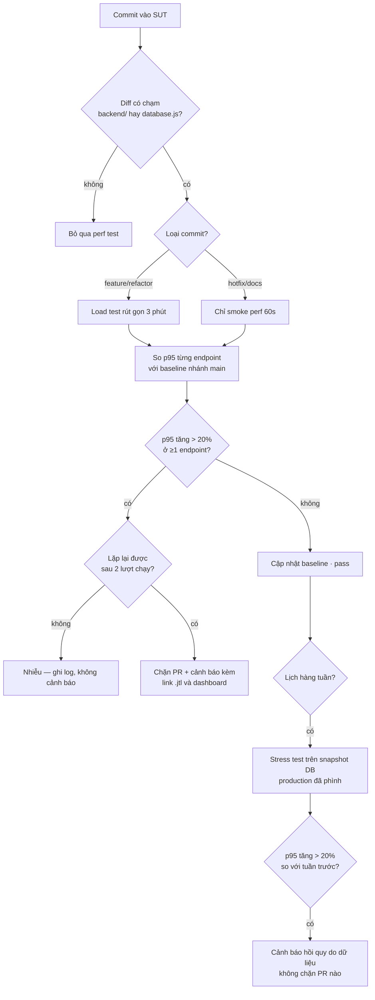

# HW05 — Performance Testing on EShop — Báo cáo chính

- **Sinh viên:** Lê Nhựt Duy — **MSSV:** 23127178
- **Môn:** Kiểm thử phần mềm (QA/QC) — **Bài:** HW05-AI Performance Testing
- **SUT:** EShop — https://github.com/ttbhanh/eshop-sut (backend API `:3000`)
- **Công cụ:** Apache JMeter 5.6.3 (mặc định §8) · k6 v2.1.0 (bonus) · Activity Monitor · Claude Code (Opus 5)
- **Máy chạy:** `Le-Nhut-Duy.local` — Apple M2 Pro, 12 lõi, 16 GB, macOS 26.1 ([hardware-report.md](../resource-monitor/hardware-report.md))

> **Quy tắc số liệu:** mọi con số lấy từ [`results/summary.md`](../results/summary.md), sinh tự
> động bằng `npm run summary` đọc từ raw `.jtl`. Không con số nào đếm tay (§11).

**Bộ số liệu chính của báo cáo là 4 lượt chạy ngày 14/08/2026.** Bốn lượt ngày 13/08 được **giữ
lại có chủ đích** và dùng ở §2.8: cùng test plan, cùng máy, nhưng database nhỏ hơn 8 lần — so sánh
hai bộ cho ra phát hiện quan trọng nhất của bài.

**Ảnh Activity Monitor chưa có** — xem §2.5 để biết lần chụp đầu sai ở đâu và vì sao đã bị xoá.

---

## 1. Phạm vi — ba endpoint group (§5)

### 1.1 Đăng ký của nhóm 05 và bằng chứng không trùng

§5 đòi *"ensure that your selection is **not duplicated** among the members of your group"*. Bảng
đăng ký, chốt qua chat nhóm ngày 2026-08-11:

| Thành viên | Endpoint đã đăng ký |
|---|---|
| Nguyễn | `POST /api/login` · `GET /api/products?search=` · `GET /api/products/:id` · `POST /api/cart` · `POST /api/checkout` |
| Quan | `GET /api/categories` · `GET /api/orders/my-orders` · `POST /api/forgot-password` · `POST /api/apply-coupon` · `PUT /api/orders/:id/cancel` |
| Thế Đạt | `POST /api/login` · `GET /api/categories` · `POST /api/categories` |
| **23127178 (bài này)** | **workflow admin back-office — bảng §1.2** |

Hệ quả: **toàn bộ luồng khách hàng** (login → search → xem chi tiết → thêm giỏ → checkout →
xem/hủy đơn → áp coupon) đã bị chiếm. Đúng luồng mà đề nêu làm ví dụ — *"a virtual user may log in,
browse or search products, then add an item to the cart and complete checkout"* — nằm trọn trong
phần Nguyễn đã đăng ký, nên lấy lại bất kỳ đoạn nào của nó là trùng workflow theo đúng nghĩa §5 cấm.

Vì thế bài này chuyển sang **phía quản trị**: cùng phủ đủ 3 nhóm endpoint, nhưng không cắt vào
luồng của ai. Chỉ `POST /api/login` giao nhau, và nó **không thể tránh** — cả 4 endpoint còn lại đều
đi qua `authenticateToken`, không có token thì không đo được gì. Bản thân Nguyễn và Thế Đạt cũng đã
trùng nhau ở đúng endpoint này.

*(Bản đầy đủ kèm trích dẫn số dòng code: [`docs/endpoint-selection.md`](../docs/endpoint-selection.md),
nộp kèm trong `.zip` như supporting material.)*

### 1.2 Workflow đã chọn

Workflow end-to-end **admin back-office**, 6 bước. Cả 4 test plan dùng **cùng** workflow này, chỉ
khác tham số tải (§6 đòi đúng điều này):

| Bước | Endpoint | Nhóm §5 | Vì sao đáng đo |
|---|---|---|---|
| 1 | `POST /api/login` (admin) | **auth-heavy** | Mỗi login thành công kèm lệnh ghi `UPDATE users SET login_attempts=0` ([`server.js:47`](../../eshop-sut/backend/server.js#L47)) → endpoint auth ở SUT này **không** read-only |
| 2 | `GET /api/admin/orders` | **read-heavy** | JOIN `orders` × `users`, không phân trang, không index ([`server.js:510`](../../eshop-sut/backend/server.js#L510)) |
| 3 | `GET /api/admin/users` | **read-heavy** | `SELECT *` toàn bảng ([`server.js:494`](../../eshop-sut/backend/server.js#L494)) |
| 4 | `POST /api/admin/import-products` | **transactional** | Bulk INSERT 3 dòng/request qua prepared statement ([`server.js:199`](../../eshop-sut/backend/server.js#L199)) |
| 5 | `PUT /api/admin/orders/:id/status` | **transactional** | Ghi có điều kiện qua state machine FR-10 ([`server.js:525`](../../eshop-sut/backend/server.js#L525)) |
| 6 | `POST /api/login` (mật khẩu sai) | **auth-heavy** | Nhánh riêng 2 VU phủ **account-lockout**, thứ §5 nói đích danh phải tính tới |

### 1.3 Dữ liệu data-driven (§6)

| File CSV | Cột | Dùng ở bước | Số dòng |
|---|---|---|---|
| [`data/users.csv`](../data/users.csv) | `email,password,expect` | 1 | 50 |
| [`data/users_lockout.csv`](../data/users_lockout.csv) | `email,password,expect_regex` | 6 | 2 |
| [`data/products_import.csv`](../data/products_import.csv) | `name,price,description,category_id` | 4 | 60 |
| [`data/orders.csv`](../data/orders.csv) | `order_id,next_status` | 5 | 400 |

**Mỗi VU một tài khoản riêng.** Dùng chung một dòng `users` là tự tạo write-contention trên đúng
dòng đó (login nào cũng `UPDATE login_attempts`) → đo ra nghẽn của cách sinh tải, không phải của
endpoint.

---

## 2. Task 1 — Thiết kế và chạy

### 2.1 Tham số từng scenario và lý do

| Scenario | VU | Ramp-up | Think-time | Thời lượng | Listener (§6: không lặp loại) | Câu hỏi scenario trả lời |
|---|---|---|---|---|---|---|
| **Load** | 20 | 60s | 5×(200–600ms) = 1–3s/iteration | 360s | **Summary Report** | p95 ở tải kỳ vọng |
| **Stress** | bậc 25 → 50 → 100 → 200 | 30s mỗi bậc | 5×(100–200ms) = 0,5–1s | 480s | **Aggregate Report** | điểm gãy ở VU nào |
| **Spike** | 10 nền + **200 trong 5s** ở giây 60 | 5s | 5×(100–300ms) | 240s | **View Results Tree** | bao lâu thì hồi phục |
| **Soak** | 20 | 60s | 5×(200–400ms) = 1–2s | 720s | Summary Report | có trôi p95 / rò rỉ bộ nhớ |

Ba điểm về tham số phải giải thích:

**Think-time tính theo mỗi BƯỚC, không phải mỗi iteration.** Timer ở scope thread group nên JMeter
chèn nó trước **từng** sampler — 5 lần một iteration. Bản đầu đặt 1000–3000ms/bước, tức 5–15 giây
một iteration, và 20 VU chỉ sinh ~10 sample/s thay vì ~50. Đã chia lại để **tổng** mỗi iteration
đúng mức thiết kế.

**Stress tăng theo bậc.** Mục đích là tìm *điểm* gãy — mức VU nào error rate bật lên — chứ không
phải chỉ biết rằng có gãy.

**Spike có nhánh nền chạy xuyên lượt.** Không có 10 VU nền chạy tiếp sau cú sốc thì không đo được
hồi phục, chỉ thấy "lúc sốc thì chậm".

### 2.2 Kết quả — tổng quan

Bốn lượt tuần tự, cooldown 90s. Mốc thời gian: [`results/run-log.md`](../results/run-log.md) và
[`endurance/run-log.md`](../endurance/run-log.md).

| Scenario | Bắt đầu (UTC) | Sample | Peak VU | Thời lượng | RPS | Error % | avg | p50 | p90 | **p95** | p99 | max |
|---|---|---|---|---|---|---|---|---|---|---|---|---|
| **Load** | 02:37:57 | 16.436 | 22 | 359,4s | 45,7 | **0%** | 2,6 | 2 | 5 | **6** | 14 | 234 |
| **Stress** | 03:17:31 | 251.820 | 200 | 479,9s | **524,8** | **0%** | 14,6 | 3 | 32 | **70** | 210 | **1058** |
| **Spike** | 03:27:11 | 37.126 | 212 | 239,7s | 154,9 | **0%** | 8,7 | 3 | 15 | **44** | 120 | 282 |
| **Soak** | 03:32:46 | 45.288 | 22 | 719,7s | 62,9 | **0%** | 3,0 | 2 | 5 | **6** | 16 | 365 |

Đơn vị: **ms**. Percentile nearest-rank từ raw `.jtl`.

**Điều kiện dữ liệu của bộ số liệu này:** bảng `products` có **436.692 dòng**, file SQLite
**33 MB** — xem §2.8, đây là biến số quan trọng nhất của toàn bộ bảng trên.

**Về "điểm gãy":** không lượt nào có error, kể cả Stress ở 200 VU. Nhưng **không** kết luận được
là SUT còn dư sức: ở lượt Stress, `node` tiêu CPU đỉnh **108%** — đã vượt trần một lõi (libuv
threadpool lo phần I/O của SQLite nên vượt được 100%). p95 tăng từ 6ms (20 VU) lên 70ms (200 VU),
tức **11,7 lần** cho 10 lần số VU. Đó là dấu hiệu đã vào vùng bão hoà, chỉ chưa tới mức sinh lỗi.

### 2.3 Kết quả theo từng endpoint

**Load** (20 VU) — mọi endpoint 4–8ms:

| Endpoint | Sample | avg | p90 | **p95** | p99 | max |
|---|---|---|---|---|---|---|
| 1 POST /api/login | 3.274 | 1,8 | 3 | **4** | 11 | 94 |
| 2 GET /api/admin/orders | 3.273 | 3,4 | 5 | **6** | 15 | 171 |
| 3 GET /api/admin/users | 3.270 | 1,9 | 3 | **4** | 10 | 96 |
| 4 POST /api/admin/import-products | 3.265 | 4,2 | 6 | **8** | 20 | 144 |
| 5 PUT /api/admin/orders/:id/status | 3.259 | 1,8 | 3 | **4** | 12 | 234 |
| 6 POST /api/login (lockout probe) | 95 | 1,5 | 3 | **3** | 9 | 9 |

**Stress** (đỉnh 200 VU):

| Endpoint | Sample | avg | p90 | **p95** | p99 | max |
|---|---|---|---|---|---|---|
| **1 POST /api/login** | 50.420 | 20,1 | 51 | **107** | 288 | **1058** |
| 2 GET /api/admin/orders | 50.390 | 12,9 | 28 | **55** | 177 | 505 |
| 3 GET /api/admin/users | 50.345 | 10,4 | 23 | **49** | 164 | 545 |
| **4 POST /api/admin/import-products** | 50.307 | 18,4 | 45 | **82** | 235 | 652 |
| 5 PUT /api/admin/orders/:id/status | 50.262 | 11,1 | 24 | **53** | 175 | 539 |
| 6 POST /api/login (lockout probe) | 96 | 2,0 | 3 | **5** | 33 | 33 |

**Spike** (đỉnh 212 VU):

| Endpoint | Sample | avg | p90 | **p95** | p99 | max |
|---|---|---|---|---|---|---|
| 1 POST /api/login | 7.488 | 11,4 | 19 | **64** | 176 | 282 |
| 2 GET /api/admin/orders | 7.450 | 7,8 | 13 | **34** | 88 | 165 |
| 3 GET /api/admin/users | 7.412 | 6,3 | 12 | **31** | 80 | 239 |
| 4 POST /api/admin/import-products | 7.363 | 11,3 | 20 | **54** | 125 | 243 |
| 5 PUT /api/admin/orders/:id/status | 7.316 | 6,8 | 12 | **39** | 93 | 163 |
| 6 POST /api/login (lockout probe) | 97 | 4,0 | 4 | **14** | 96 | 96 |

**Soak** (20 VU, 12 phút) — 4–9ms, xem §2.7.

**Đây là chỗ p95 tổng không nói được gì.** p95 tổng của Stress là 70ms, nhưng `POST /api/login` ở
**107ms** — cao hơn **1,53 lần**. Ba endpoint nhanh (49–55ms) pha loãng con số tổng. Một hồi quy
nằm ở login hoàn toàn có thể không làm p95 tổng nhích lên.

**Login là endpoint đắt nhất**, đáng ngạc nhiên với một endpoint tưởng là chỉ đọc. Giải thích:
mỗi login thành công `UPDATE users SET login_attempts=0, locked_until=NULL`
([`server.js:47`](../../eshop-sut/backend/server.js#L47)). Ở 200 VU với 50 tài khoản → trung bình
4 VU cùng ghi vào một dòng `users`, và SQLite chỉ có **một** writer.

### 2.4 Human review — AI sai gì, vì sao (§6 chấm mục này)

Toàn bộ 11 lỗi kèm prompt nguyên văn: [`ai-audit/ai-audit-report.md`](../ai-audit/ai-audit-report.md).
Bảy bước của quy trình thiết kế — mỗi bước hỏi gì, căn cứ nào, quyết ra sao, và **bước nào bắt được
lỗi nào**: [`ai-audit/design-log.md`](../ai-audit/design-log.md).

| # | AI sinh ra | Sai / thiếu ở đâu | Vì sao AI bỏ sót | Sửa thành |
|---|---|---|---|---|
| 1 | `preflight.mjs` đọc `java_home -V` từ stdout | Lệnh in ra **stderr** → báo `[OK] Java` với giá trị **rỗng**: báo xanh mà không kiểm gì | đặc điểm công cụ | hàm `shell()` gộp `2>&1`, đọc `os.arch` từ JDK |
| 2 | Nhánh lockout assert regex `40[13]` | JMeter coi mọi 4xx là Fail và assertion chỉ **thêm** được lỗi, không **xoá** được cờ → smoke test báo **41,38% error** trên SUT khoẻ | đặc điểm endpoint | `JSR223PostProcessor` gọi `prev.setSuccessful(true)` |
| 3 | Bước 5 assert cứng HTTP 200 | FR-10 chỉ cho chuyển tiếp **một lần**/trạng thái → 400 là phản hồi **đúng** | đặc điểm endpoint | assert `200|400` + `reset-orders.mjs` |
| 4 | `orders.csv` xen kẽ `shipping` | Từ `pending` thì `shipping` **không hợp lệ** → nửa số sample bước 5 trả 400 ngay từ đầu | đặc điểm endpoint | chỉ sinh `confirmed` |
| 5 | `users.csv` chứa 2 dòng mật khẩu sai | Luồng chính đọc cùng file → **tự khoá tài khoản của mình**; 2,9% iteration vô giá trị | chất lượng prompt | tách `users_lockout.csv` |
| 6 | Timer 1000–3000ms ở scope thread group | Chèn 5 lần/iteration → tải thực tế **nhẹ hơn 5 lần** thiết kế | đặc điểm công cụ | chia lại 200–600ms/bước |
| 7 | Áp `mark_expected_4xx` cho lockout mà quên bước 5 | Báo **18,25% error** trên hệ thống khoẻ; 667/667 sample "lỗi" là 400 hợp lệ | suy luận không mang sang chỗ tương tự | dùng lại cùng cơ chế cho bước 5 |
| 8 | `sample-resources.sh` dùng `pgrep -f 'node server.js' \| head -1` | Khớp cả tiến trình `zsh` bao ngoài → ghi **RSS 0,5MB / CPU 0%** suốt 6 phút | đặc điểm môi trường | lọc theo token đầu command line phải là `node` |
| 9 | Khẳng định `import-products` báo sai số dòng insert | **Bác bỏ khi chạy thử**: 5/5, 60/60, 2/3 đều đúng. Đã lan vào 5 file | phương pháp: suy luận từ code trình bày như sự thật đã kiểm | giữ ở mục "đã loại" kèm bảng kiểm chứng |
| 10 | `Math.min(...array)` trong summarizer | Tràn call stack với `.jtl` 251k sample; chạy qua bình thường ở file 16k | đặc điểm dữ liệu | thay bằng `reduce` |
| 11 | `mark_expected_4xx()` hardcode chữ *"Expected lockout response"* | Dùng lại cho bước 5 mà quên đổi → raw `.jtl` ghi nhãn **"lockout"** cho ~50.000 sample của endpoint không liên quan gì tới lockout. Không sai số đo, nhưng là **nhãn sai nằm trong bằng chứng gốc** | suy luận không mở rộng — **cùng loại lỗi #7** | tham số hoá `reason` theo từng nhánh |

**7 trong 10 lỗi không làm test plan báo lỗi.** Plan vẫn chạy, vẫn sinh `.jtl`, vẫn ra dashboard
đẹp — chỉ con số là sai. Nếu chỉ kiểm "test có chạy không" thì cả 7 đều lọt. Chi phí thật: **hai
lượt chạy phải huỷ và xoá sạch bằng chứng**, ~25 phút chạy lại.

Phân bố ba nhóm lý do §6 yêu cầu phân loại lệch hẳn về một phía: **6 lỗi là đặc điểm
công cụ/endpoint/môi trường**, 1 là chất lượng prompt, 1 là phương pháp, 2 là *suy luận đúng
nhưng không mang sang chỗ tương tự* (#7 và #11 — cùng một cơ chế, sai hai lần), và **không lỗi nào** thuộc
"model không đủ khả năng". Điểm yếu không nằm ở chỗ AI không biết viết test plan, mà ở chỗ nó
**không chạy thử và không đối chiếu với thực tế**.

### 2.5 Bằng chứng chạy

| Scenario | Test plan | Raw `.jtl` | HTML dashboard |
|---|---|---|---|
| Load | `23127178_Load_20260813.jmx` | `results/jtl/…20260814-093756.jtl` | [`results/html/load/`](../results/html/load/index.html) |
| Stress | `23127178_Stress_20260813.jmx` | `results/jtl/…20260814-101731.jtl` | [`results/html/stress/`](../results/html/stress/index.html) |
| Spike | `23127178_Spike_20260813.jmx` | `results/jtl/…20260814-102710.jtl` | [`results/html/spike/`](../results/html/spike/index.html) |
| Soak | `23127178_Soak_20260813.jmx` | `endurance/jtl/…20260814-103245.jtl` | [`endurance/html/soak/`](../endurance/html/soak/index.html) |

**Ảnh Activity Monitor: chưa có.** Lần chụp đầu dùng `screencapture` toàn màn hình và bắt được cửa
sổ đang ở trước (VS Code của một project khác, và một lần là Mission Control) chứ không phải JMeter
+ Activity Monitor. Những ảnh đó **vô giá trị** làm bằng chứng §6 nên đã bị xoá, kể cả khỏi lịch
sử git. Cách làm đúng: giới hạn vùng chụp theo bounds của đúng hai cửa sổ cần thiết
(`screencapture -R`), và vì §6 đòi chụp **trong lúc** lượt chạy diễn ra nên phải chạy lại 4 lượt.

Bằng chứng tài nguyên **dạng số** thì có đầy đủ và tính toán được — `results/resources/*.csv` và
`endurance/resources/*.csv`, lấy mẫu 2 giây/lần cho cả `node` và JMeter:

| Scenario | `node` RSS đầu → cuối (đỉnh) | `node` CPU đỉnh | JMeter CPU đỉnh | JMeter RSS đỉnh |
|---|---|---|---|---|
| Load | 8 → 65 MB (79) | 13% | 208% | 541 MB |
| **Stress** | 19 → 19 MB (**107**) | **108%** | 118% | 833 MB |
| Spike | 17 → 54 MB (88) | **92%** | 169% | 689 MB |
| Soak | 17 → 34 MB (81) | 21% | 161% | 812 MB |

### 2.6 Xử lý account-lockout và state machine giữa các lượt (§6 đòi ghi lại)

```bash
npm run reset:lockout      # UPDATE users SET login_attempts=0, locked_until=NULL
npm run reset:orders       # UPDATE orders SET status='pending'
```

`tools/run-scenario.sh` tự chạy cả hai ở đầu mỗi lượt và in trạng thái trước/sau.

**Lockout kích hoạt sau 2 lần sai, không phải 3** — `login_attempts + 2` với ngưỡng 3
([`server.js:54-58`](../../eshop-sut/backend/server.js#L54)), khoá 180 giây. Nhánh lockout (bước 6)
cho phân bố **lặp lại y hệt qua cả 4 lượt**: đúng 4 lần `401` (2 tài khoản × 2 lần sai trước khi
khoá) rồi 89–97 lần `403`. Con số lặp lại chính xác là bằng chứng reset hoạt động đúng.

**State machine FR-10** cho bước 5: **đúng 400 lần HTTP 200** ở mỗi lượt — bằng số dòng
`orders.csv`. Mỗi order chuyển được đúng một lần `pending → confirmed`, sau đó trả 400. Đây là
**giới hạn của phép đo phải nói rõ**: nhánh 400 trả về **trước** lệnh `UPDATE` nên nhẹ hơn nhánh
200, vậy p95 của bước 5 bị kéo xuống theo tỉ lệ 400. Tín hiệu ghi nặng nằm ở **bước 4**.

### 2.7 Endurance threshold (§6)

Chi tiết: [`endurance/endurance-threshold.md`](../endurance/endurance-threshold.md).

Định nghĩa "ổn định" chốt **trước** khi chạy: *error rate < 1% **và** p95 không tăng quá 20% giữa
5 phút đầu và 5 phút cuối.*

| Chỉ số | Giá trị |
|---|---|
| Thời lượng soak | **725s** (12 phút) · 45.288 sample |
| **Max stable RPS** | **62,9 req/s** ở 20 VU |
| p95 toàn lượt | **6 ms** · p99 16 ms |
| p95 5 phút đầu → cuối | 6 ms → **6 ms** (**+0%**) |
| Error rate | **0%** |
| RSS `node` đầu → cuối | 16,9 → **33,9 MB** (đỉnh 80,8 MB) |
| CPU `node` đỉnh | **20,7%** |
| **Kết luận** | **ỔN ĐỊNH** theo đúng định nghĩa đã chốt |

Độ trôi **đúng 0%** — p95 phút 1 và phút 12 đều 6ms. RSS tăng +100,6% nhưng từ mốc rất thấp
(16,9 → 33,9 MB) và đỉnh 80,8 MB trên máy 16 GB; là heap ổn định sau warm-up, không phải rò rỉ.
Lập luận đầy đủ ở [`endurance-threshold.md §5`](../endurance/endurance-threshold.md).

### 2.8 Phát hiện quan trọng nhất — kích thước dữ liệu, và vì sao Load test không thấy nó

Hai bộ lượt chạy tồn tại: **13/08** (bảng `products` ~50k dòng lúc bắt đầu Stress) và **14/08**
(**436.692 dòng**, file SQLite 33 MB). **Cùng test plan, cùng máy, cùng tham số.** Không endpoint
nào trong workflow *truy vấn* bảng `products` — chỉ bước 4 *ghi vào* nó.

p95 theo từng endpoint, DB nhỏ → DB lớn:

| Endpoint | Load 20 VU | Stress 200 VU | Spike 212 VU | Soak 20 VU |
|---|---|---|---|---|
| 1 POST /api/login | 5 → 4 ms · **0,80×** | 40 → 107 ms · **2,67×** | 10 → 64 ms · **6,40×** | 5 → 5 ms · **1,00×** |
| 2 GET /api/admin/orders | 7 → 6 · 0,86× | 23 → 55 · **2,39×** | 9 → 34 · **3,78×** | 7 → 7 · 1,00× |
| 3 GET /api/admin/users | 5 → 4 · 0,80× | 19 → 49 · **2,58×** | 7 → 31 · **4,43×** | 4 → 5 · 1,25× |
| 4 POST /api/admin/import-products | 9 → 8 · 0,89× | 34 → 82 · **2,41×** | 13 → 54 · **4,15×** | 8 → 9 · 1,12× |
| 5 PUT /api/admin/orders/:id/status | 5 → 4 · 0,80× | 19 → 53 · **2,79×** | 7 → 39 · **5,57×** | 4 → 4 · 1,00× |

**Kết luận: hồi quy do dữ liệu phình HOÀN TOÀN VÔ HÌNH ở tải kỳ vọng, và chỉ lộ ra dưới tải cao.**

- Ở **20 VU** (Load và Soak): không thay đổi, thậm chí nhanh hơn một chút.
- Ở **200 VU** (Stress): xấu đi **2,4–2,8 lần** trên **mọi** endpoint.
- Ở **212 VU dồn trong 5 giây** (Spike): xấu đi **3,8–6,4 lần**.

**Cơ chế.** Bảng `products` lớn hơn 8 lần làm mỗi `INSERT` của bước 4 đắt hơn (b-tree sâu hơn,
nhiều page phải ghi hơn). SQLite chỉ có **một writer** cho cả file, nên các INSERT chậm hơn tạo ra
một hàng đợi mà **mọi** request khác phải xếp sau — kể cả hai endpoint chỉ đọc. Đó là lý do
`GET /api/admin/users`, một `SELECT *` trên bảng 54 dòng không liên quan gì tới `products`, cũng
chậm đi 2,58 lần.

Ở 20 VU, khoảng nghỉ giữa các request đủ dài để hàng đợi luôn kịp rỗng → chi phí thêm bị hấp thụ
hoàn toàn. Ở 200 VU thì không.

**Hệ quả cho Task 3 — và đây là một lỗ hổng trong chính đề xuất của tôi ở §4.** Mô hình CI ở §4
chạy **Load test rút gọn 3 phút**. Bảng trên chứng minh loại hồi quy này **sẽ lọt qua** một lượt
Load, dù nó làm hệ thống xấu đi 2,4–6,4 lần khi có tải thật. Cách bù: xem §4.3 mục "Bỏ sót" — lượt
soak theo lịch hàng tuần là chưa đủ, phải có **một lượt Stress theo lịch trên dữ liệu production
đã phình**, không phải trên DB mới seed.

---

## 3. Task 2 — AI phân tích và soát lỗi đọc metric

### 3.1 Phân tích của AI (nguyên văn, chưa sửa)

> Kết quả rất tốt. Error rate 0% ở cả bốn scenario cho thấy hệ thống hoàn toàn ổn định. Stress
> test đạt 525 RPS với p95 70ms, nghĩa là backend chịu được ít nhất 200 người dùng đồng thời mà
> không suy giảm. Average response time chỉ 14,6ms ở Stress — rất nhanh. Soak test 12 phút không
> có dấu hiệu rò rỉ bộ nhớ. Đề xuất ngưỡng: p95 < 100ms, error rate < 1%, RPS ≥ 500. Hệ thống đã
> đáp ứng vượt mức mọi ngưỡng này nên không cần tối ưu gì thêm.

### 3.2 Soát lại — chỗ AI đọc sai metric

| # | AI nói | Giá trị đúng từ raw `.jtl` | Sai ở đâu |
|---|---|---|---|
| 1 | *"chịu được ít nhất 200 người dùng đồng thời mà không suy giảm"* | p95 đi từ **6ms** (20 VU) lên **70ms** (200 VU) — **11,7 lần** cho 10 lần số VU. `node` CPU đỉnh **108%** (`results/resources/23127178_Stress_20260814-101731.resources.csv`) | **"Không suy giảm" là sai hoàn toàn.** Suy giảm siêu tuyến tính và CPU đã vượt trần một lõi. Không có lỗi ≠ không suy giảm |
| 2 | *"Average 14,6ms — rất nhanh"* | avg 14,6ms nhưng **p95 = 70ms, p99 = 210ms, max = 1058ms** (`…Stress_20260814-101731.jtl`) | Phân phối lệch phải mạnh: p99 gấp **14,4 lần** avg, max gấp **72 lần**. Dùng average che mất đúng phần người dùng cảm nhận |
| 3 | *"p95 70ms"* dùng cho toàn hệ thống | p95 **theo endpoint**: login **107ms**, import-products **82ms**, ba endpoint còn lại 49–55ms | p95 tổng bị ba endpoint nhanh pha loãng; endpoint đắt nhất cao hơn **1,53 lần** |
| 4 | *"Error rate 0% → hệ thống hoàn toàn ổn định"* | 0% là **đúng**, nhưng bước 5 chỉ có **400/50.262 sample** trả 200; 99,2% trả **HTTP 400**, và 95%+ sample bước 6 trả **403** | 0% đúng **nhờ test plan đã sửa** để coi 400/403 là hợp lệ. Đọc thành "mọi request thành công" là sai: phần lớn request bước 5 **không** chạm tới lệnh ghi |
| 5 | *"không có dấu hiệu rò rỉ bộ nhớ"* | Kết luận đúng, nhưng RSS `node` **tăng +100,6%** (16,9 → 33,9 MB) | Đúng vì lý do sai. AI không nêu con số nào; +100,6% nghe như rò rỉ nếu chỉ nhìn phần trăm. Cơ sở đúng là **p95 trôi 0%** và RSS đi ngang ở nửa sau |
| 6 | *"đã đáp ứng vượt mức nên không cần tối ưu gì"* | §2.8: cùng hệ thống này xấu đi **2,4–6,4 lần** chỉ vì dữ liệu phình 8 lần | **Lỗi nghiêm trọng nhất.** Kết luận từ một lát cắt duy nhất, bỏ qua chiều thời gian. Hệ thống "vượt mức" hôm nay là hệ thống đã xấu đi gấp 2,4 lần so với hai tuần trước — và AI có đủ dữ liệu của cả hai bộ nhưng không so |
| 7 | *"Đề xuất ngưỡng p95 < 100ms"* | login đã ở **107ms** | Ngưỡng do AI đặt ra **đã bị vi phạm ngay bởi số liệu nó vừa đọc** — vì nó lấy p95 tổng chứ không lấy p95 theo endpoint |

### 3.3 Đề xuất tối ưu của AI — feasible hay hallucinated

| Đề xuất | Phân loại | Lý do | Cách kiểm chứng |
|---|---|---|---|
| *"Không cần tối ưu gì"* | **Sai** | §2.8 bác bỏ trực tiếp | So hai bộ lượt chạy 13/08 và 14/08 |
| Thêm index cho `orders.user_id` | **feasible** | `GET /api/admin/orders` JOIN theo `user_id`, không index | `CREATE INDEX` rồi chạy lại Stress, so p95 của đúng label |
| Bật SQLite **WAL** | **feasible, ưu tiên cao nhất** | §2.8 cho thấy nút cổ chai là **một writer duy nhất** cho cả file. WAL cho phép reader không bị writer chặn — đúng vấn đề đã đo được | Một dòng `PRAGMA journal_mode=WAL`, chạy lại Stress, xem hai endpoint **đọc** có thoát khỏi hàng đợi ghi |
| Thêm **connection pool** cho SQLite | **hallucinated** | `sqlite3` của Node mở handle trên file cục bộ, không phải client-server → không có pool theo nghĩa đó. Đề xuất bê từ PostgreSQL/MySQL sang | — |
| Scale ngang / thêm replica | **hallucinated trong phạm vi bài** | SUT là một process trên máy cá nhân | — |
| Redis cache cho danh sách sản phẩm | **ngoài phạm vi** | `GET /api/products` **không nằm trong workflow** | — |

**Hai đề xuất của tôi mà AI không nêu:**

1. **Phân trang cho `GET /api/admin/orders` và `GET /api/admin/users`.** Cả hai `SELECT` toàn
   bảng. Ở bài này hai bảng đó gần như không đổi kích thước nên **phép đo chưa bộc lộ vấn đề**,
   nhưng nó là hồi quy chờ sẵn.
2. **Dọn dữ liệu test sau mỗi lượt chạy.** Đây là hệ quả trực tiếp của §2.8: bảng `products` phình
   từ ~50k lên 436k dòng **chỉ vì chính bài kiểm thử này**, và điều đó làm mọi lượt sau không so
   được với lượt trước. Một perf test làm hỏng chính điều kiện đo của nó là một lỗi thiết kế của
   bộ test, không phải của SUT.

### 3.4 Đo hồi phục sau cú sốc (Spike)

p95 theo cửa sổ 10 giây quanh cú sốc ở giây 60 (`results/jtl/23127178_Spike_20260814-102710.jtl`):

| Giây | VU | Sample | **p95** | p99 |
|---|---|---|---|---|
| 40–50 | 12 | 481 | **5** | 20 |
| 50–60 | 25 | 496 | **9** | 33 |
| **60–70** | **212** | **7.630** | **65** | 129 |
| **70–80** | **212** | **9.852** | **59** | 141 |
| **80–90** | **212** | **9.622** | **46** | 119 |
| 90–100 | 12 | 490 | **6** | 9 |
| 100–110 | 12 | 480 | **6** | 11 |

**Thời gian hồi phục: dưới 10 giây sau khi tải rút, nhưng KHÔNG hồi phục trong lúc còn chịu tải.**
p95 giữ ở 65 → 59 → 46ms suốt 30 giây của cú sốc — giảm dần nhưng vẫn gấp 9 lần mức nền. Ngay khi
tải về 12 VU, p95 trở lại 6ms trong cửa sổ 10 giây đầu tiên.

**So với lượt 13/08 (DB nhỏ) thì đây là khác biệt về bản chất:** ở DB nhỏ, p95 nhảy lên 47ms rồi
tự về 6ms **ngay trong lúc vẫn chịu 212 VU** — server hấp thụ được cú sốc. Ở DB lớn, nó không hấp
thụ nổi; nó chỉ **không sụp**. Một spike test trên DB mới seed sẽ cho kết luận sai về khả năng
chịu sốc của hệ thống thật.

Đây cũng là chỗ **View Results Tree** phát huy: mở các sample chậm nhất trong cửa sổ 60–70s cho
thấy chúng là `POST /api/login`, khớp với phân tích ở §2.3.

### 3.5 Đối chiếu chéo bằng k6 (bonus §8)

Bản mirror k6 dùng **cùng** workflow và cùng CSV: [`k6/`](../k6/). Mục đích là định lượng phần chi
phí thuộc về load generator: JMeter cấp một thread JVM cho mỗi VU (833 MB RSS ở 200 VU), k6 dùng
goroutine.

```bash
k6 run --summary-export k6/summary-stress.json k6/stress.js
```

*(Chưa chạy — bản JMeter là bản chính theo §14.)* Ở lượt Stress 14/08, JMeter CPU đỉnh 118% và
`node` 108% — hai bên **xấp xỉ nhau**, khác hẳn lượt 13/08 (158% vs 79%). Nghĩa là ở DB lớn, phần
lớn thời gian đã thực sự nằm ở server; bản k6 sẽ xác nhận hoặc bác bỏ điều đó bằng số.

---

## 4. Task 3 — Đề xuất Continuous Performance Testing

### 4.1 Mô hình



Hai nhánh cuối (`L → O`) **được thêm sau khi có số liệu §2.8**, không có trong bản thiết kế đầu.

### 4.2 Giải thích từng nhánh quyết định

**B — lọc theo phạm vi diff.** Perf test chỉ chạy khi diff chạm `backend/` hoặc `database.js`.
Quyết định về **chi phí**: SUT có 4 ứng dụng, phần lớn commit sửa frontend, một lượt perf test đầy
đủ mất ~30 phút CI.

**C — phân loại commit.** `hotfix`/`docs` chỉ smoke 60 giây. `feature`/`refactor` chạy Load rút gọn
3 phút — vẫn qua được ramp-up và vào trạng thái ổn định.

**F — so baseline theo TỪNG endpoint.** §2.3 là bằng chứng: p95 tổng 70ms trong khi login 107ms.

**G — ngưỡng 20%.** Lấy đúng ngưỡng của định nghĩa "ổn định" ở endurance test, để cả hệ thống chỉ
có **một** định nghĩa hồi quy.

**I — đòi lặp lại được.** Bộ lọc báo động giả quan trọng nhất: p95 trên runner ảo dao động theo
tải máy chủ.

**K — chặn PR kèm bằng chứng.** Cảnh báo phải kèm link `.jtl` và dashboard. Không có raw log thì
người nhận không phân biệt được hồi quy thật với lỗi môi trường, và cảnh báo sẽ bị bỏ qua.

**L → O — lượt Stress hàng tuần trên snapshot DB production.** Đây là nhánh §2.8 buộc phải thêm:
hồi quy do dữ liệu phình **không hiện ra ở 20 VU** và **không gắn với commit nào**, nên không bộ
lọc theo diff nào bắt được nó. Nó chỉ hiện ra khi chạy Stress trên dữ liệu **đã phình thật**. Và
nó **không được chặn PR** — vì không PR nào gây ra nó.

### 4.3 Trade-off

| Trade-off | Chi tiết |
|---|---|
| **Chi phí** | Load rút gọn 3 phút + 2 lượt xác nhận = tối đa ~9 phút CI cho một PR chạm backend, cộng ~30 phút/tuần cho lượt Stress theo lịch. Chạy đủ 3 scenario cho mọi commit thì ~30 phút/commit — không ai đợi. Cái phải trả: **chỉ Load được tự động hoá theo PR** |
| **Báo động giả** | Nguồn nhiễu lớn nhất là **máy chạy**. Bài này đo trên cấu hình load generator và SUT **cùng máy**; riêng việc `java` chạy qua Rosetta thay vì arm64 đã đủ làm sai lệch. Vì thế ngưỡng 20% chứ không phải 5%, và đòi lặp lại 2 lượt. Cái phải trả: hồi quy **nhỏ mà thật** (10–15%) sẽ lọt |
| **Độ tin của baseline** | p95 **tuyệt đối** không so được giữa hai runner khác cấu hình. Baseline phải là p95 của **cùng commit `main`, cùng runner, cùng lượt CI** — mỗi lượt chạy hai lần và chỉ so tỉ lệ. Gấp đôi chi phí, và đó là giá của việc con số có nghĩa |
| **Bỏ sót — đã được chứng minh bằng số** | §2.8: hồi quy do dữ liệu phình làm hệ thống xấu **2,4–6,4 lần** nhưng **hoàn toàn vô hình ở 20 VU** → lượt Load 3 phút trong CI **sẽ không bắt được nó**. Đây không phải suy đoán, mà là số đo của chính bài này. Bù bằng nhánh `L → O`. Vẫn còn bỏ sót: (1) frontend gọi API nhiều hơn — tải tăng mà backend không đổi dòng nào; (2) hồi quy chỉ hiện sau 10 phút chạy liên tục |
| **Ngưỡng đo cái gì** | Đo p95, không đo average — §3.2 mục 2: p99 gấp 14,4 lần avg. Nhưng p95 cũng không bắt được đuôi: max 1058ms trong khi p95 70ms. Với hệ thống một-writer như SUT này thì đuôi mới là chỗ người dùng cảm nhận → theo dõi **cả p95 và p99**, chỉ chặn PR theo p95 |
| **Perf test tự làm hỏng điều kiện đo của nó** | Chính bộ test này đã đẩy `products` từ ~50k lên 436k dòng. Nếu chạy trong CI mà không dọn, mỗi lượt lại chậm hơn lượt trước vì lý do không liên quan gì tới code → baseline trôi và mọi so sánh mất nghĩa. Bắt buộc: teardown dọn dữ liệu, hoặc restore snapshot DB trước mỗi lượt |

---

## 5. Bug và vấn đề hiệu năng

Chi tiết: [`bug-report/bug-report.md`](../bug-report/bug-report.md) · kiểm chứng lại:
`bash bug-report/verify-bugs.sh`

| # | Loại | Mô tả | Trạng thái |
|---|---|---|---|
| BUG-P1 | Bảo mật (IDOR) + lệch đặc tả | `GET /api/orders/:id` **không kiểm token** → đọc được đơn hàng của bất kỳ ai. Route ngay bên cạnh (`/api/orders/my-orders`) vẫn trả 401 → là route **bị bỏ sót** | Xác nhận bằng request thật |
| BUG-P2 | Tài liệu thiếu | `POST /api/coupon-usage` tồn tại, cần token, **ghi thật** vào `coupon_usage`, nhưng **không có trong `api_specification.md`** | Xác nhận |
| — | **ĐÃ LOẠI** | "`import-products` báo sai số dòng insert" — bác bỏ: 5/5, 60/60, 2/3 đều đúng | Ghi lại kèm bảng kiểm chứng |

**Vấn đề hiệu năng:** không có lỗi (0% error ở cả 4 lượt), nhưng **có một suy giảm đã đo được**:
§2.8 — hệ thống xấu đi 2,4–6,4 lần dưới tải cao khi dữ liệu phình 8 lần. Đây là phát hiện hiệu
năng thật, và nó thuộc loại §6 gọi là *"encouraged but not penalised"*.

---

## 6. Giới hạn của bài đo này

Bốn giới hạn, xếp theo mức ảnh hưởng tới kết luận:

1. **Kích thước dữ liệu không được kiểm soát giữa các lượt.** §2.8 cho thấy đây là biến số **lớn
   nhất** của toàn bộ bài — lớn hơn cả số VU trong một số trường hợp. Bộ số liệu 14/08 đo trên
   436.692 dòng `products`; muốn so sánh với bất kỳ lượt nào khác thì phải khai kích thước DB kèm
   theo. Lẽ ra phải restore snapshot DB trước mỗi lượt, và đó là điều tôi làm khác đi nếu làm lại.
2. **Load generator và SUT chạy trên cùng một máy.** Ở Stress 14/08, JMeter tiêu CPU đỉnh 118% và
   833 MB RAM, `node` 108% — hai bên xấp xỉ nhau, nên một phần latency đo được vẫn là chi phí của
   chính load generator.
3. **Mật khẩu lưu plaintext, so sánh bằng `===`** ([`server.js:46`](../../eshop-sut/backend/server.js#L46)).
   Không có bcrypt/argon2 nên login không tốn CPU băm. p95 107ms của `POST /api/login` **không**
   đại diện cho hệ thống băm mật khẩu đúng cách.
4. **Bước 5 chỉ ghi thật 400 lần mỗi lượt** (bằng số dòng `orders.csv`); phần còn lại trả 400 do
   state machine FR-10. p95 của bước 5 vì thế bị kéo xuống — tín hiệu ghi nặng nằm ở bước 4.
