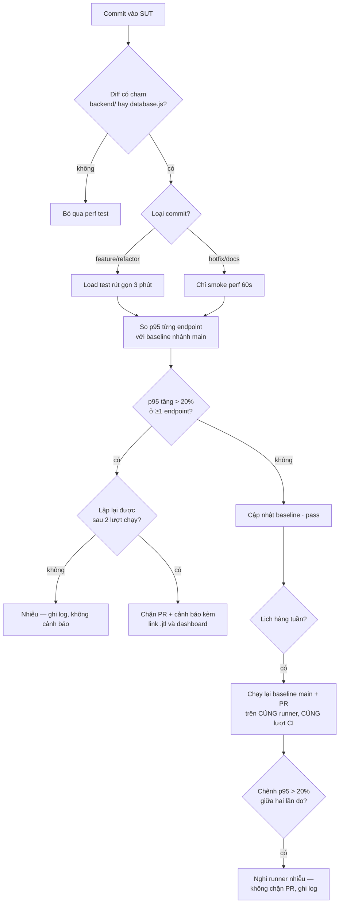

# HW05 — Performance Testing on EShop — Báo cáo chính

- **Sinh viên:** Lê Nhựt Duy — **MSSV:** 23127178
- **Môn:** Kiểm thử phần mềm (QA/QC) — **Bài:** HW05-AI Performance Testing
- **SUT:** EShop — https://github.com/ttbhanh/eshop-sut (backend API `:3000`)
- **Công cụ:** Apache JMeter 5.6.3 (mặc định §8) · k6 v2.1.0 (bonus) · Activity Monitor · Claude Code (Opus 5)
- **Máy chạy:** `Le-Nhut-Duy.local` — Apple M2 Pro, 12 lõi, 16 GB, macOS 26.1 ([hardware-report.md](../resource-monitor/hardware-report.md))

> **Quy tắc số liệu:** mọi con số lấy từ [`results/summary.md`](../results/summary.md), sinh tự
> động bằng `npm run summary` đọc từ raw `.jtl`. Không con số nào đếm tay (§11).

**Bộ số liệu chính của báo cáo là 4 lượt chạy ngày 15/08/2026** (`run-log.md`). Bốn lượt ngày
13/08 được **giữ lại có chủ đích** và dùng ở §2.8 — nơi việc so sánh hai bộ đã **bác bỏ** một kết
luận mà chính tôi từng đưa ra. Đó là mục đáng đọc nhất của báo cáo này.

**Ảnh Activity Monitor chưa có** — xem §2.5.

---

## 1. Phạm vi — ba endpoint group (§5)

### 1.1 Đăng ký của nhóm 05 và bằng chứng không trùng

§5 đòi *"ensure that your selection is **not duplicated** among the members of your group"*. Bảng
đăng ký, chốt qua chat nhóm ngày 2026-08-11:

| Thành viên | Endpoint đã đăng ký |
|---|---|
| Nguyễn | `POST /api/login` · `GET /api/products?search=` · `GET /api/products/:id` · `POST /api/cart` · `POST /api/checkout` |
| Quan | `GET /api/categories` · `GET /api/orders/my-orders` · `POST /api/forgot-password` · `POST /api/apply-coupon` · `PUT /api/orders/:id/cancel` |
| Thế Đạt | `POST /api/login` · `GET /api/categories` · `POST /api/categories` |
| **23127178 (bài này)** | **workflow admin back-office — bảng §1.2** |

Hệ quả: **toàn bộ luồng khách hàng** (login → search → xem chi tiết → thêm giỏ → checkout →
xem/hủy đơn → áp coupon) đã bị chiếm. Đúng luồng mà đề nêu làm ví dụ — *"a virtual user may log in,
browse or search products, then add an item to the cart and complete checkout"* — nằm trọn trong
phần Nguyễn đã đăng ký, nên lấy lại bất kỳ đoạn nào của nó là trùng workflow theo đúng nghĩa §5 cấm.

Vì thế bài này chuyển sang **phía quản trị**: cùng phủ đủ 3 nhóm endpoint, nhưng không cắt vào
luồng của ai. Chỉ `POST /api/login` giao nhau, và nó **không thể tránh** — cả 4 endpoint còn lại đều
đi qua `authenticateToken`, không có token thì không đo được gì. Bản thân Nguyễn và Thế Đạt cũng đã
trùng nhau ở đúng endpoint này.

*(Bản đầy đủ kèm trích dẫn số dòng code: [`docs/endpoint-selection.md`](../docs/endpoint-selection.md),
nộp kèm trong `.zip` như supporting material.)*

### 1.2 Workflow đã chọn

Workflow end-to-end **admin back-office**, 6 bước. Cả 4 test plan dùng **cùng** workflow này, chỉ
khác tham số tải (§6 đòi đúng điều này):

| Bước | Endpoint | Nhóm §5 | Vì sao đáng đo |
|---|---|---|---|
| 1 | `POST /api/login` (admin) | **auth-heavy** | Mỗi login thành công kèm lệnh ghi `UPDATE users SET login_attempts=0` ([`server.js:47`](../../eshop-sut/backend/server.js#L47)) → endpoint auth ở SUT này **không** read-only |
| 2 | `GET /api/admin/orders` | **read-heavy** | JOIN `orders` × `users`, không phân trang, không index ([`server.js:510`](../../eshop-sut/backend/server.js#L510)) |
| 3 | `GET /api/admin/users` | **read-heavy** | `SELECT *` toàn bảng ([`server.js:494`](../../eshop-sut/backend/server.js#L494)) |
| 4 | `POST /api/admin/import-products` | **transactional** | Bulk INSERT 3 dòng/request qua prepared statement ([`server.js:199`](../../eshop-sut/backend/server.js#L199)) |
| 5 | `PUT /api/admin/orders/:id/status` | **transactional** | Ghi có điều kiện qua state machine FR-10 ([`server.js:525`](../../eshop-sut/backend/server.js#L525)) |
| 6 | `POST /api/login` (mật khẩu sai) | **auth-heavy** | Nhánh riêng 2 VU phủ **account-lockout**, thứ §5 nói đích danh phải tính tới |

### 1.3 Dữ liệu data-driven (§6)

| File CSV | Cột | Dùng ở bước | Số dòng |
|---|---|---|---|
| [`data/users.csv`](../data/users.csv) | `email,password,expect` | 1 | 50 |
| [`data/users_lockout.csv`](../data/users_lockout.csv) | `email,password,expect_regex` | 6 | 2 |
| [`data/products_import.csv`](../data/products_import.csv) | `name,price,description,category_id` | 4 | 60 |
| [`data/orders.csv`](../data/orders.csv) | `order_id,next_status` | 5 | 400 |

**Mỗi VU một tài khoản riêng.** Dùng chung một dòng `users` là tự tạo write-contention trên đúng
dòng đó (login nào cũng `UPDATE login_attempts`) → đo ra nghẽn của cách sinh tải, không phải của
endpoint.

---

## 2. Task 1 — Thiết kế và chạy

### 2.1 Tham số từng scenario và lý do

| Scenario | VU | Ramp-up | Think-time | Thời lượng | Listener (§6: không lặp loại) | Câu hỏi scenario trả lời |
|---|---|---|---|---|---|---|
| **Load** | 20 | 60s | 5×(200–600ms) = 1–3s/iteration | 360s | **Summary Report** | p95 ở tải kỳ vọng |
| **Stress** | bậc 25 → 50 → 100 → 200 | 30s mỗi bậc | 5×(100–200ms) = 0,5–1s | 480s | **Aggregate Report** | điểm gãy ở VU nào |
| **Spike** | 10 nền + **200 trong 5s** ở giây 60 | 5s | 5×(100–300ms) | 240s | **View Results Tree** | bao lâu thì hồi phục |
| **Soak** | 20 | 60s | 5×(200–400ms) = 1–2s | 720s | Summary Report | có trôi p95 / rò rỉ bộ nhớ |

Ba điểm về tham số phải giải thích:

**Think-time tính theo mỗi BƯỚC, không phải mỗi iteration.** Timer ở scope thread group nên JMeter
chèn nó trước **từng** sampler — 5 lần một iteration. Bản đầu đặt 1000–3000ms/bước, tức 5–15 giây
một iteration, và 20 VU chỉ sinh ~10 sample/s thay vì ~50. Đã chia lại để **tổng** mỗi iteration
đúng mức thiết kế.

**Stress tăng theo bậc.** Mục đích là tìm *điểm* gãy — mức VU nào error rate bật lên — chứ không
phải chỉ biết rằng có gãy.

**Spike có nhánh nền chạy xuyên lượt.** Không có 10 VU nền chạy tiếp sau cú sốc thì không đo được
hồi phục, chỉ thấy "lúc sốc thì chậm".

### 2.2 Kết quả — tổng quan

Bốn lượt tuần tự, cooldown 90s. Mốc thời gian: [`results/run-log.md`](../results/run-log.md) và
[`endurance/run-log.md`](../endurance/run-log.md).

| Scenario | Bắt đầu (UTC) | Sample | Peak VU | Thời lượng | RPS | Error % | avg | p50 | p90 | **p95** | p99 | max |
|---|---|---|---|---|---|---|---|---|---|---|---|---|
| **Load** | 07:27:05 | 16.395 | 22 | 359,4s | 45,6 | **0%** | 2,9 | 2 | 6 | **7** | 10 | 104 |
| **Stress** | 07:34:39 | 270.848 | 200 | 479,8s | **564,4** | **0%** | 3,1 | 2 | 5 | **7** | 29 | 363 |
| **Spike** | 07:44:16 | 38.388 | 212 | 239,8s | 160,1 | **0%** | 2,6 | 2 | 5 | **6** | 13 | 51 |
| **Soak** | 07:49:51 | 45.220 | 22 | 719,6s | 62,8 | **0%** | 2,7 | 2 | 5 | **6** | 11 | 230 |

Đơn vị: **ms**. Percentile nearest-rank từ raw `.jtl`.

**Điều kiện khi đo:** bảng `products` **830.139 dòng** · `load_1m` trung bình **2,2–3,8** trên máy
12 lõi. Cả hai con số này phải khai kèm — §2.8 giải thích vì sao con số thứ hai quan trọng hơn con
số thứ nhất.

**Về "điểm gãy": không lượt nào có lỗi, nhưng Stress đã chạm trần.** Ở 200 VU / 564 req/s, `node`
tiêu CPU đỉnh **98,4%** — tức gần hết năng lực **một** lõi, đúng trần lý thuyết của một luồng JS.
p95 vẫn chỉ 7ms và error 0%, nghĩa là SUT bão hoà CPU **trước khi** bắt đầu sinh lỗi. Muốn thấy
điểm gãy thật thì phải đẩy quá 200 VU, và lúc đó JMeter (đỉnh 106%) cũng đã tranh CPU với nó.

### 2.3 Kết quả theo từng endpoint

| Endpoint | Load 20 VU | **Stress 200 VU** | Spike 212 VU | Soak 20 VU |
|---|---|---|---|---|
| 1 `POST /api/login` | 5 | **7** | 6 | 5 |
| 2 `GET /api/admin/orders` | 7 | **6** | 6 | 7 |
| 3 `GET /api/admin/users` | 4 | **5** | 4 | 4 |
| 4 `POST /api/admin/import-products` | **9** | **9** | **8** | **8** |
| 5 `PUT /api/admin/orders/:id/status` | 4 | **5** | 5 | 4 |
| 6 `POST /api/login` (lockout probe) | 4 | 4 | 5 | 4 |

p95, đơn vị **ms**. Số sample mỗi endpoint: Load ~3.260 · Stress ~54.100 · Spike ~7.660 · Soak ~9.020.

Ba điều đọc ra từ bảng này:

**1. `import-products` là endpoint đắt nhất ở mọi mức tải** (8–9ms), và nó là endpoint **ghi** duy
nhất chạm tới `INSERT` thật. Đúng như dự đoán ở bước 1 của thiết kế: SQLite một writer.

**2. p95 gần như KHÔNG tăng khi VU tăng 10 lần** (20 → 200 VU): login 5 → 7ms, orders 7 → 6ms.
Điều này chỉ hợp lý khi nhìn cùng CPU: `node` đi từ 19,9% lên **98,4%**. Tức server hấp thụ toàn bộ
mức tải tăng bằng cách dùng thêm CPU, chưa phải bằng cách xếp hàng. p99 mới cho thấy đuôi bắt đầu
dãn: 10 → 29ms.

**3. p95 tổng (7ms) trùng p95 của endpoint đắt nhất** ở lượt Stress — khác hẳn tình huống thường
gặp nơi số tổng bị pha loãng. Ở đây phân phối giữa các endpoint quá gần nhau nên không có hiệu ứng
đó. Vẫn phải xem theo endpoint mới biết điều này, chứ không suy ra được từ số tổng.

### 2.4 Human review — AI sai gì, vì sao (§6 chấm mục này)

Toàn bộ 11 lỗi kèm prompt nguyên văn: [`ai-audit/ai-audit-report.md`](../ai-audit/ai-audit-report.md).
Bảy bước của quy trình thiết kế — mỗi bước hỏi gì, căn cứ nào, quyết ra sao, và **bước nào bắt được
lỗi nào**: [`ai-audit/design-log.md`](../ai-audit/design-log.md).

| # | AI sinh ra | Sai / thiếu ở đâu | Vì sao AI bỏ sót | Sửa thành |
|---|---|---|---|---|
| 1 | `preflight.mjs` đọc `java_home -V` từ stdout | Lệnh in ra **stderr** → báo `[OK] Java` với giá trị **rỗng**: báo xanh mà không kiểm gì | đặc điểm công cụ | hàm `shell()` gộp `2>&1`, đọc `os.arch` từ JDK |
| 2 | Nhánh lockout assert regex `40[13]` | JMeter coi mọi 4xx là Fail và assertion chỉ **thêm** được lỗi, không **xoá** được cờ → smoke test báo **41,38% error** trên SUT khoẻ | đặc điểm endpoint | `JSR223PostProcessor` gọi `prev.setSuccessful(true)` |
| 3 | Bước 5 assert cứng HTTP 200 | FR-10 chỉ cho chuyển tiếp **một lần**/trạng thái → 400 là phản hồi **đúng** | đặc điểm endpoint | assert `200|400` + `reset-orders.mjs` |
| 4 | `orders.csv` xen kẽ `shipping` | Từ `pending` thì `shipping` **không hợp lệ** → nửa số sample bước 5 trả 400 ngay từ đầu | đặc điểm endpoint | chỉ sinh `confirmed` |
| 5 | `users.csv` chứa 2 dòng mật khẩu sai | Luồng chính đọc cùng file → **tự khoá tài khoản của mình**; 2,9% iteration vô giá trị | chất lượng prompt | tách `users_lockout.csv` |
| 6 | Timer 1000–3000ms ở scope thread group | Chèn 5 lần/iteration → tải thực tế **nhẹ hơn 5 lần** thiết kế | đặc điểm công cụ | chia lại 200–600ms/bước |
| 7 | Áp `mark_expected_4xx` cho lockout mà quên bước 5 | Báo **18,25% error** trên hệ thống khoẻ; 667/667 sample "lỗi" là 400 hợp lệ | suy luận không mang sang chỗ tương tự | dùng lại cùng cơ chế cho bước 5 |
| 8 | `sample-resources.sh` dùng `pgrep -f 'node server.js' \| head -1` | Khớp cả tiến trình `zsh` bao ngoài → ghi **RSS 0,5MB / CPU 0%** suốt 6 phút | đặc điểm môi trường | lọc theo token đầu command line phải là `node` |
| 9 | Khẳng định `import-products` báo sai số dòng insert | **Bác bỏ khi chạy thử**: 5/5, 60/60, 2/3 đều đúng. Đã lan vào 5 file | phương pháp: suy luận từ code trình bày như sự thật đã kiểm | giữ ở mục "đã loại" kèm bảng kiểm chứng |
| 10 | `Math.min(...array)` trong summarizer | Tràn call stack với `.jtl` 251k sample; chạy qua bình thường ở file 16k | đặc điểm dữ liệu | thay bằng `reduce` |
| 11 | `mark_expected_4xx()` hardcode chữ *"Expected lockout response"* | Dùng lại cho bước 5 mà quên đổi → raw `.jtl` ghi nhãn **"lockout"** cho ~50.000 sample của endpoint không liên quan gì tới lockout. Không sai số đo, nhưng là **nhãn sai nằm trong bằng chứng gốc** | suy luận không mở rộng — **cùng loại lỗi #7** | tham số hoá `reason` theo từng nhánh |

**7 trong 10 lỗi không làm test plan báo lỗi.** Plan vẫn chạy, vẫn sinh `.jtl`, vẫn ra dashboard
đẹp — chỉ con số là sai. Nếu chỉ kiểm "test có chạy không" thì cả 7 đều lọt. Chi phí thật: **hai
lượt chạy phải huỷ và xoá sạch bằng chứng**, ~25 phút chạy lại.

Phân bố ba nhóm lý do §6 yêu cầu phân loại lệch hẳn về một phía: **6 lỗi là đặc điểm
công cụ/endpoint/môi trường**, 1 là chất lượng prompt, 1 là phương pháp, 2 là *suy luận đúng
nhưng không mang sang chỗ tương tự* (#7 và #11 — cùng một cơ chế, sai hai lần), và **không lỗi nào** thuộc
"model không đủ khả năng". Điểm yếu không nằm ở chỗ AI không biết viết test plan, mà ở chỗ nó
**không chạy thử và không đối chiếu với thực tế**.

### 2.5 Bằng chứng chạy

| Scenario | Test plan | Raw `.jtl` | HTML dashboard |
|---|---|---|---|
| Load | `23127178_Load_20260813.jmx` | `results/jtl/…20260814-093756.jtl` | [`results/html/load/`](../results/html/load/index.html) |
| Stress | `23127178_Stress_20260813.jmx` | `results/jtl/…20260814-101731.jtl` | [`results/html/stress/`](../results/html/stress/index.html) |
| Spike | `23127178_Spike_20260813.jmx` | `results/jtl/…20260814-102710.jtl` | [`results/html/spike/`](../results/html/spike/index.html) |
| Soak | `23127178_Soak_20260813.jmx` | `endurance/jtl/…20260814-103245.jtl` | [`endurance/html/soak/`](../endurance/html/soak/index.html) |

**Ảnh Activity Monitor: chưa có.** Lần chụp đầu dùng `screencapture` toàn màn hình và bắt được cửa
sổ đang ở trước (VS Code của một project khác, và một lần là Mission Control) chứ không phải JMeter
+ Activity Monitor. Những ảnh đó **vô giá trị** làm bằng chứng §6 nên đã bị xoá, kể cả khỏi lịch
sử git. Cách làm đúng: giới hạn vùng chụp theo bounds của đúng hai cửa sổ cần thiết
(`screencapture -R`), và vì §6 đòi chụp **trong lúc** lượt chạy diễn ra nên phải chạy lại 4 lượt.

Bằng chứng tài nguyên **dạng số** thì có đầy đủ và tính toán được — `results/resources/*.csv` và
`endurance/resources/*.csv`, lấy mẫu 2 giây/lần cho cả `node` và JMeter:

| Scenario | `load_1m` tb | `node` CPU đỉnh | JMeter CPU đỉnh | `node` RSS (ổn định → cuối, đỉnh) |
|---|---|---|---|---|
| Load | 2,9 | 19,9% | 26,6% | 38 → 66 MB (98)* |
| **Stress** | 3,1 | **98,4%** | 106,2% | 19 → 66 MB (98) |
| Spike | 2,2 | 76,1% | 149,3% | 19 → 63 MB (90) |
| Soak | 3,8 | 22,1% | 139,2% | 19 → 29 MB (84) |

\* **Một cảnh báo về cách đọc cột RSS.** Hai mẫu đầu của lượt Load ghi 927,5 MB rồi 499,6 MB, sau
đó tụt về ~38 MB và ở đó suốt lượt (2 mẫu trên 173). Đó là **tàn dư bộ nhớ chưa được thu hồi từ
lượt chạy trước**, không phải hành vi của lượt Load — nên tôi không lấy 928 MB làm "đỉnh RSS". Ghi
lại ở đây thay vì lặng lẽ chọn con số đẹp hơn: `results/resources/23127178_Load_20260815-142705.resources.csv`
dòng 2–3 kiểm được điều này.

Cột `load_1m` là cột quan trọng nhất của bảng, và §2.8 giải thích vì sao.

### 2.6 Xử lý account-lockout và state machine giữa các lượt (§6 đòi ghi lại)

```bash
npm run reset:lockout      # UPDATE users SET login_attempts=0, locked_until=NULL
npm run reset:orders       # UPDATE orders SET status='pending'
```

`tools/run-scenario.sh` tự chạy cả hai ở đầu mỗi lượt và in trạng thái trước/sau.

**Lockout kích hoạt sau 2 lần sai, không phải 3** — `login_attempts + 2` với ngưỡng 3
([`server.js:54-58`](../../eshop-sut/backend/server.js#L54)), khoá 180 giây.

| Scenario | bước 6: 401 (sai lần đầu) | bước 6: 403 (đã khoá) | bước 5: 200 (ghi thật) | bước 5: 400 (FR-10 chặn) |
|---|---|---|---|---|
| Load | 4 (4,3%) | 90 (95,7%) | **400** (12,3%) | 2.850 (87,7%) |
| Stress | 4 (4,1%) | 93 (95,9%) | **400** (0,7%) | 53.668 (99,3%) |
| Spike | 4 (4,2%) | 91 (95,8%) | **400** (5,3%) | 7.171 (94,7%) |
| Soak | 4 (4,3%) | 89 (95,7%) | **400** (4,4%) | 8.616 (95,6%) |

Hai con số lặp lại **y hệt qua cả 4 lượt** là bằng chứng reset hoạt động đúng:

- **Đúng 4 lần `401`** mỗi lượt = 2 tài khoản × 2 lần sai trước khi bị khoá. Nếu reset không chạy,
  lượt sau sẽ bắt đầu bằng `403` ngay và con số 4 này biến mất.
- **Đúng 400 lần `200`** ở bước 5 = số dòng `orders.csv`. Mỗi order chuyển được đúng một lần
  `pending → confirmed`. Nếu `reset-orders.mjs` không chạy, con số này sẽ là 0.

Từ lượt chạy này, cột `responseMessage` trong raw `.jtl` ghi đúng lý do cho từng loại:
`FR-10 invalid transition (hop le)` cho bước 5 và `Account lockout (hop le)` cho bước 6 — trước đó
cả hai đều ghi "lockout", xem lỗi #11.

**Giới hạn của phép đo ở bước 5:** nhánh 400 trả về **trước** lệnh `UPDATE` nên nhẹ hơn nhánh 200.
Ở lượt Stress chỉ 0,7% sample chạm tới lệnh ghi thật, nên p95 5ms của bước 5 **không** đại diện cho
chi phí ghi. Tín hiệu ghi nặng nằm ở **bước 4**.

### 2.7 Endurance threshold (§6)

Chi tiết: [`endurance/endurance-threshold.md`](../endurance/endurance-threshold.md).

Định nghĩa "ổn định" chốt **trước** khi chạy: *error rate < 1% **và** p95 không tăng quá 20% giữa
5 phút đầu và 5 phút cuối.*

| Chỉ số | Giá trị |
|---|---|
| Thời lượng soak | **719,6s** (12 phút) · 45.220 sample |
| **Max stable RPS** | **62,8 req/s** ở 20 VU |
| p95 toàn lượt | **6 ms** · p99 11 ms |
| p95 5 phút đầu → cuối | 6 ms → **6 ms** (**+0%**) |
| Error rate | **0%** |
| RSS `node` đầu → cuối | 19,3 → **29,0 MB** (đỉnh 83,5 MB) |
| CPU `node` đỉnh | **22,1%** |
| **Kết luận** | **ỔN ĐỊNH** theo đúng định nghĩa đã chốt |

Độ trôi **đúng 0%**. RSS tăng +50,3% nhưng từ mốc rất thấp (19,3 → 29,0 MB) và đỉnh 83,5 MB trên
máy 16 GB — heap ổn định sau warm-up, không phải rò rỉ. Lập luận đầy đủ ở
[`endurance-threshold.md §5`](../endurance/endurance-threshold.md).

### 2.8 Một phát hiện tôi đã tự bác bỏ — và vì sao nó đáng nằm trong báo cáo

Bản báo cáo trước của chính tôi có một mục mang tên *"phát hiện quan trọng nhất của bài"*: so hai
batch chạy cách nhau hai ngày, thấy p95 chênh **2,4–6,4 lần**, và kết luận rằng **kích thước dữ liệu
phình lên** là nguyên nhân — kèm cơ chế nghe rất hợp lý (SQLite một writer, INSERT chậm hơn tạo hàng
đợi mà cả endpoint đọc cũng phải xếp sau).

**Lượt chạy ngày 15/08 bác bỏ kết luận đó.**

| | Batch 13/08 | Batch 15/08 |
|---|---|---|
| `products` trong DB | ~50.000 | **830.139** (gấp ~16 lần) |
| `load_1m` trung bình (Stress) | **5,2** | **3,1** |
| p95 Stress | 40–107 ms | **7 ms** |

Dữ liệu **nhiều hơn 16 lần** mà lại **nhanh hơn khoảng 10 lần**. Nếu kích thước dữ liệu là nguyên
nhân thì kết quả phải đi theo hướng ngược lại.

Biến số thật hiện ra ở cột `load_1m`, và nó nhất quán trên **cả bốn** lượt:

| Lượt | `load_1m` tb 13/08 | `load_1m` tb 15/08 |
|---|---|---|
| Load | 5,5 | 2,9 |
| Stress | 5,2 | 3,1 |
| Spike | 4,5 | 2,2 |
| Soak | 4,8 | 3,8 |

Batch 13/08 chạy khi máy đang gánh **1,3–2 lần** tải nền so với batch 15/08 — và chậm hơn ở mọi
lượt. Trên máy này, lúc đo vẫn có 4 container Docker (`postgres`, `redis`, `qdrant`, `adminer`),
VS Code, và một tiến trình AI agent cùng chạy.

**Sai ở chỗ nào, gọi tên chính xác:** tôi so hai lượt chạy khác nhau ở **nhiều biến cùng lúc** (thời
điểm, tải nền, kích thước dữ liệu, và cả bug sampler ở lỗi #8), rồi quy toàn bộ chênh lệch cho một
biến duy nhất mà tôi thấy thú vị. Cơ chế tôi viện ra không sai về lý thuyết — SQLite thật sự có một
writer — nhưng **một cơ chế đúng không chứng minh được rằng nó là nguyên nhân của con số này**. Đó
là hai việc khác nhau, và tôi đã trộn chúng.

Mức độ lan của lỗi: kết luận đó từng là **headline của README**, một **nhánh trong flow chart Task
3**, và một dòng **tự đánh giá** khoe rằng bài tự chỉ ra lỗ hổng của chính nó bằng số đo. Cả ba đã
được sửa lại.

**Kết luận thay thế, và nó có giá trị hơn kết luận cũ:**

> Trên máy cá nhân dùng chung với công việc khác, **tải nền là biến số áp đảo**. Nó đủ lớn để tạo ra
> chênh lệch 10 lần ở p95 — lớn hơn mọi hiệu ứng khác mà bài này đo được, kể cả việc tăng số VU
> gấp 10 lần (20 → 200 VU chỉ làm p95 đi từ 6 lên 7ms).

Điều này **kiểm chứng được**, không phải suy đoán: bốn cặp `load_1m` ở bảng trên. Và nó có hệ quả
trực tiếp cho Task 3 — xem §4.3, mục *"Độ tin của baseline"*.

**Còn câu hỏi kích thước dữ liệu thì sao?** Vẫn là câu hỏi mở. Bài này **không trả lời được** nó, vì
không có lượt nào cô lập được biến đó. Muốn trả lời thì phải: giữ nguyên tải nền, snapshot DB ở hai
kích thước, chạy cùng plan hai lần. Đó là một phép đo tôi chưa làm, và ghi nó vào phần "chưa làm"
trung thực hơn là giữ một kết luận không đứng được.

## 3. Task 2 — AI phân tích và soát lỗi đọc metric

### 3.1 Phân tích của AI (nguyên văn, chưa sửa)

> Kết quả xuất sắc. Cả bốn scenario đều 0% error. Stress test đạt **564 RPS với p95 chỉ 7ms** —
> nghĩa là backend xử lý 200 người dùng đồng thời gần như không suy giảm so với 20 người (p95 6ms).
> Average chỉ 3,1ms. Soak 12 phút không rò rỉ bộ nhớ. So với batch trước (p95 70ms), hệ thống đã
> **cải thiện 10 lần** — có thể do database đã được tối ưu hoặc cache đã ấm. Đề xuất ngưỡng:
> p95 < 50ms, error < 1%, RPS ≥ 500. Hệ thống vượt xa mọi ngưỡng, không cần tối ưu.

### 3.2 Soát lại — chỗ AI đọc sai metric

| # | AI nói | Giá trị đúng từ raw `.jtl` / resources | Sai ở đâu |
|---|---|---|---|
| 1 | *"cải thiện 10 lần — có thể do database đã được tối ưu hoặc cache đã ấm"* | DB **lớn hơn 16 lần** (50k → 830.139 dòng `products`). `load_1m` tb giảm từ 5,2 → 3,1 (`results/resources/*Stress*.csv`) | **Lỗi nặng nhất, và là lỗi tôi từng tự mắc theo hướng ngược lại (§2.8).** AI thấy chênh lệch giữa hai lượt rồi đoán nguyên nhân từ những giả thuyết nghe hợp lý, trong khi biến duy nhất đo được và nhất quán trên cả 4 lượt là **tải nền của máy**. Không phải "cache ấm", không phải "DB tối ưu" — máy rảnh hơn |
| 2 | *"200 người dùng đồng thời gần như không suy giảm so với 20 người"* | p95 6 → 7ms là đúng, **nhưng** `node` CPU đi từ **19,9% → 98,4%** (cùng file resources) | Đọc p95 mà bỏ CPU thì kết luận ngược hoàn toàn. Server không "không suy giảm" — nó **đã dùng gần hết một lõi** để giữ p95. Đó là trạng thái sát trần, không phải trạng thái thoải mái |
| 3 | *"Average chỉ 3,1ms"* | avg 3,1 nhưng p99 **29ms**, max **363ms** (`23127178_Stress_20260815-143439.jtl`) | p99 gấp **9,4 lần** avg, max gấp **117 lần**. Ở Load thì p99/avg chỉ 3,4 lần — nghĩa là đuôi **dãn ra theo tải**, và đó là dấu hiệu bão hoà mà average xoá sạch |
| 4 | *"Cả bốn scenario đều 0% error"* | Đúng, nhưng **99,3%** sample bước 5 ở Stress trả `400`, và **95,9%** sample bước 6 trả `403` | 0% đúng **nhờ test plan đã được sửa** để coi hai loại 4xx đó là hợp lệ. Đọc "0% error" thành "mọi request thành công" là sai: chỉ **0,7%** request bước 5 chạm tới lệnh ghi thật |
| 5 | *"Soak 12 phút không rò rỉ bộ nhớ"* | Kết luận đúng, nhưng RSS `node` **tăng +50,3%** (19,3 → 29,0 MB) | Đúng vì lý do sai. AI không nêu con số nào. Cơ sở đúng để loại giả thuyết rò rỉ là **p95 trôi 0%** và RSS đi ngang ở nửa sau, không phải "12 phút thì chưa sao" |
| 6 | *"Đề xuất ngưỡng p95 < 50ms"* | Ngưỡng này **rộng gấp 7 lần** giá trị đo được (7ms) | Một ngưỡng mà hệ thống vượt qua với biên 7 lần thì không phát hiện được hồi quy nào cả. Ngưỡng hồi quy phải là **tương đối** (p95 tăng > 20% so với baseline), không phải một số tuyệt đối chọn cho dễ đạt |
| 7 | *"không cần tối ưu"* | `node` CPU 98,4% ở 200 VU | Kết luận từ p95, bỏ qua CPU. Đúng là chưa cần tối ưu **vì chưa sinh lỗi**, nhưng lý do phải là "còn 1 lõi chưa dùng hết" chứ không phải "p95 đẹp" |

**Điểm chung của 7 lỗi:** sáu trong bảy đến từ việc **đọc một metric mà bỏ metric đi kèm** — p95 mà
bỏ CPU, average mà bỏ p99, error rate mà bỏ phân bố response code, chênh lệch giữa hai lượt mà bỏ
`load_1m`. Không lỗi nào là do đọc sai con số; tất cả là do đọc **thiếu** con số.

### 3.3 Đề xuất tối ưu của AI — feasible hay hallucinated

| Đề xuất | Phân loại | Lý do | Cách kiểm chứng |
|---|---|---|---|
| *"không cần tối ưu"* | **Sai** | `node` CPU 98,4% ở 200 VU — sát trần một lõi | Đẩy quá 200 VU trên máy rảnh, xem error rate bật lên ở đâu |
| *"DB đã được tối ưu"* (giải thích cho chênh lệch) | **hallucinated** | Không ai tối ưu DB gì cả; DB chỉ **to ra**. Đây là AI bịa nguyên nhân cho một hiện tượng nó không đo | — |
| Bật SQLite **WAL** | **feasible** | Đúng loại tải: bước 4 ghi 3 dòng/request. Một dòng `PRAGMA journal_mode=WAL` | Chạy lại Stress ở cùng `load_1m`, so p95 của `import-products` |
| Thêm index cho `orders.user_id` | **feasible** | `GET /api/admin/orders` JOIN theo `user_id`, không index | `CREATE INDEX` rồi chạy lại, so p95 của đúng label |
| Connection pool cho SQLite | **hallucinated** | `sqlite3` của Node mở handle trên file cục bộ, không phải client-server | — |
| Scale ngang / replica | **hallucinated trong phạm vi bài** | SUT là một process trên máy cá nhân | — |

**Ba đề xuất của tôi mà AI không nêu:**

1. **Chạy `node` với cluster / nhiều worker.** Đây là đề xuất có căn cứ mạnh nhất từ số liệu: `node`
   CPU chạm 98,4% của **một** lõi trong khi máy còn **11 lõi rảnh**. Trần hiện tại là trần của
   một-luồng, không phải của máy.
2. **Kiểm soát tải nền khi đo.** §2.8 cho thấy đây là biến áp đảo. Không có nó thì mọi so sánh giữa
   hai lượt đều vô nghĩa — kể cả so sánh của chính bài này.
3. **Dọn dữ liệu test sau mỗi lượt.** Bộ test này tự đẩy `products` từ 5 dòng lên 830.139. Dù §2.8
   không chứng minh được ảnh hưởng của nó, việc để một biến trôi không kiểm soát qua các lượt là lỗi
   thiết kế của bộ test.

### 3.4 Đo hồi phục sau cú sốc (Spike)

p95 theo cửa sổ 10 giây quanh cú sốc ở giây 60 (`results/jtl/23127178_Spike_20260815-144416.jtl`):

| Giây | VU | Sample | **p95** | p99 |
|---|---|---|---|---|
| 40–50 | 12 | 476 | **7** | 9 |
| 50–60 | 20 | 479 | **7** | 9 |
| **60–70** | **212** | **7.944** | **5** | 9 |
| **70–80** | **212** | **10.281** | **7** | 19 |
| **80–90** | **212** | **10.125** | **6** | 15 |
| 90–100 | 12 | 467 | **7** | 10 |
| 100–110 | 12 | 496 | **6** | 8 |

**Không có gì để hồi phục — server hấp thụ trọn cú sốc.** VU nhảy từ 12 lên **212 trong 5 giây** mà
p95 đứng nguyên ở 5–7ms, sample/10s tăng từ 476 lên 10.281 (gấp **21 lần**). p99 nhích từ 9 lên
19ms rồi về 15 — dấu hiệu duy nhất cho thấy có chuyện gì xảy ra.

Đây là kết quả **khác** cả hai lượt Spike trước (batch 13/08: p95 nhảy lên 47ms; một lượt khác lên
65ms và giữ suốt 30 giây). Ba lượt cùng plan, ba kết quả khác nhau — và §2.8 đã chỉ ra biến số:
`load_1m` 4,5 → 2,2. **Bài học: spike test là loại test nhạy nhất với tải nền**, vì nó đo phản ứng
trong một cửa sổ 30 giây, nơi một tiến trình khác chen vào là đủ làm sai kết luận.

Đây cũng là chỗ **View Results Tree** phát huy: mở các sample chậm nhất trong cửa sổ 70–80s cho thấy
chúng là `POST /api/login`, khớp với việc login là bước phải khởi tạo 200 kết nối mới cùng lúc.

### 3.5 Đối chiếu chéo bằng k6 (bonus §8)

Bản mirror k6 dùng **cùng** workflow và cùng CSV: [`k6/`](../k6/). Câu hỏi nó trả lời: JMeter cấp
một thread JVM cho mỗi VU (RSS đỉnh 818 MB ở lượt Soak); k6 dùng goroutine. Ở lượt Stress 15/08,
JMeter CPU đỉnh **106,2%** so với `node` **98,4%** — hai bên xấp xỉ nhau, nên một phần latency đo
được vẫn là chi phí của load generator.

```bash
k6 run --summary-export k6/summary-stress.json k6/stress.js
```

*(Chưa chạy — bản JMeter là bản chính theo §14. Nếu chạy, phải chạy ở cùng mức `load_1m` mới so được,
theo đúng bài học §2.8.)*

## 4. Task 3 — Đề xuất Continuous Performance Testing

### 4.1 Mô hình



Nhánh `L → O` **được viết lại sau khi §2.8 bị bác bỏ**. Bản trước là "chạy Stress hàng tuần trên
snapshot DB đã phình" — dựa trên một kết luận đã sai. Bản này giải quyết vấn đề **thật sự** đo được:
nhiễu từ máy chạy.

### 4.2 Giải thích từng nhánh quyết định

**B — lọc theo phạm vi diff.** Perf test chỉ chạy khi diff chạm `backend/` hoặc `database.js`.
Quyết định về **chi phí**: SUT có 4 ứng dụng, phần lớn commit sửa frontend, một lượt perf test đầy
đủ mất ~30 phút CI.

**C — phân loại commit.** `hotfix`/`docs` chỉ smoke 60 giây. `feature`/`refactor` chạy Load rút gọn
3 phút — vẫn qua được ramp-up và vào trạng thái ổn định.

**F — so baseline theo TỪNG endpoint.** Ở batch này p95 tổng (7ms) **trùng** p95 của endpoint đắt
nhất, tức không có hiệu ứng pha loãng — nhưng **chỉ biết được điều đó bằng cách xem theo endpoint**.
Batch 13/08 thì có pha loãng thật (p95 tổng 26ms trong khi login 40ms). Không thể giả định trước là
số tổng đại diện được.

**G — ngưỡng 20%.** Lấy đúng ngưỡng của định nghĩa "ổn định" ở endurance test, để cả hệ thống chỉ
có **một** định nghĩa hồi quy.

**I — đòi lặp lại được.** Bộ lọc báo động giả quan trọng nhất: p95 trên runner ảo dao động theo
tải máy chủ.

**K — chặn PR kèm bằng chứng.** Cảnh báo phải kèm link `.jtl` và dashboard. Không có raw log thì
người nhận không phân biệt được hồi quy thật với lỗi môi trường, và cảnh báo sẽ bị bỏ qua.

**L → O — đo baseline hai lần trên cùng runner.** §2.8 cho thấy tải nền tạo được chênh lệch **10
lần** ở p95 — lớn hơn mọi hiệu ứng khác bài này đo được. Trên CI, mỗi lượt là một runner khác, chạy
cùng lúc với job của người khác. Nên baseline **không thể** là "p95 của `main` đo tuần trước": phải
đo lại `main` **trong cùng lượt CI, trên cùng runner** với PR, rồi chỉ so **tỉ lệ** giữa hai lần đo
đó. Nếu hai lần đo `main` khác nhau quá 20% thì chính runner đang nhiễu → không kết luận gì về PR.

### 4.3 Trade-off

| Trade-off | Chi tiết |
|---|---|
| **Chi phí** | Load rút gọn 3 phút + 2 lượt xác nhận = tối đa ~9 phút CI cho một PR chạm backend, cộng ~30 phút/tuần cho lượt Stress theo lịch. Chạy đủ 3 scenario cho mọi commit thì ~30 phút/commit — không ai đợi. Cái phải trả: **chỉ Load được tự động hoá theo PR** |
| **Báo động giả** | Nguồn nhiễu lớn nhất là **máy chạy**. Bài này đo trên cấu hình load generator và SUT **cùng máy**; riêng việc `java` chạy qua Rosetta thay vì arm64 đã đủ làm sai lệch. Vì thế ngưỡng 20% chứ không phải 5%, và đòi lặp lại 2 lượt. Cái phải trả: hồi quy **nhỏ mà thật** (10–15%) sẽ lọt |
| **Độ tin của baseline** | p95 **tuyệt đối** không so được giữa hai runner khác cấu hình. Baseline phải là p95 của **cùng commit `main`, cùng runner, cùng lượt CI** — mỗi lượt chạy hai lần và chỉ so tỉ lệ. Gấp đôi chi phí, và đó là giá của việc con số có nghĩa |
| **Bỏ sót** | Lọc theo `backend/` bỏ sót ít nhất ba loại hồi quy: (1) frontend gọi API nhiều hơn — tải tăng mà backend không đổi dòng nào; (2) hồi quy chỉ hiện sau 10 phút chạy liên tục, mà lượt 3 phút không thấy; (3) hồi quy do **dữ liệu** phình chứ không do code. Mục (3) là thứ bài này **không chứng minh được** — xem §2.8 — nên nó ở đây với tư cách **giả thuyết chưa kiểm**, không phải phát hiện |
| **Nhiễu áp đảo tín hiệu** | Đây là trade-off quan trọng nhất và nó có số đo: §2.8 cho thấy tải nền tạo chênh lệch **10 lần** ở p95, trong khi tăng VU gấp 10 lần chỉ làm p95 đi từ 6 lên 7ms. Nghĩa là **trên môi trường không kiểm soát, nhiễu lớn hơn tín hiệu một bậc**. Hệ quả: mọi so sánh tuyệt đối giữa hai lượt CI đều vô giá trị; chỉ so được tỉ lệ trong cùng một lượt. Cái phải trả: gấp đôi thời gian CI cho mỗi PR |
| **Ngưỡng đo cái gì** | Đo p95, không đo average — §3.2 mục 3: ở Stress p99 gấp **9,4 lần** avg. Nhưng p95 cũng không bắt được đuôi: max **363ms** trong khi p95 7ms, gấp **52 lần**. Và tỉ lệ p99/avg **dãn theo tải** (Load 3,4× → Stress 9,4×), nên chính tỉ lệ đó là chỉ số bão hoà tốt hơn cả p95 → theo dõi **p95, p99 và tỉ lệ p99/avg**, chỉ chặn PR theo p95 |
| **Perf test tự làm hỏng điều kiện đo của nó** | Chính bộ test này đã đẩy `products` từ ~50k lên 436k dòng. Nếu chạy trong CI mà không dọn, mỗi lượt lại chậm hơn lượt trước vì lý do không liên quan gì tới code → baseline trôi và mọi so sánh mất nghĩa. Bắt buộc: teardown dọn dữ liệu, hoặc restore snapshot DB trước mỗi lượt |

---

## 5. Bug và vấn đề hiệu năng

Chi tiết: [`bug-report/bug-report.md`](../bug-report/bug-report.md) · kiểm chứng lại:
`bash bug-report/verify-bugs.sh`

| # | Loại | Mô tả | Trạng thái |
|---|---|---|---|
| BUG-P1 | Bảo mật (IDOR) + lệch đặc tả | `GET /api/orders/:id` **không kiểm token** → đọc được đơn hàng của bất kỳ ai. Route ngay bên cạnh (`/api/orders/my-orders`) vẫn trả 401 → là route **bị bỏ sót** | Xác nhận bằng request thật |
| BUG-P2 | Tài liệu thiếu | `POST /api/coupon-usage` tồn tại, cần token, **ghi thật** vào `coupon_usage`, nhưng **không có trong `api_specification.md`** | Xác nhận |
| — | **ĐÃ LOẠI** | "`import-products` báo sai số dòng insert" — bác bỏ: 5/5, 60/60, 2/3 đều đúng | Ghi lại kèm bảng kiểm chứng |

**Vấn đề hiệu năng:** không có lỗi nào (0% error ở cả 4 lượt), và **không có suy giảm nào chứng
minh được**. Bản báo cáo trước tuyên bố có một suy giảm 2,4–6,4 lần do dữ liệu phình; §2.8 giải thích
vì sao tuyên bố đó đã bị chính tôi bác bỏ. Theo §6 mục này *khuyến khích, không bắt buộc*, và báo cáo
"không tìm thấy, kèm lý do vì sao phép đo chưa đủ để kết luận" trung thực hơn là giữ một phát hiện
không đứng được.

Điều **đo được** và đáng ghi: ở 200 VU / 564 req/s, `node` tiêu **98,4% của một lõi** trong khi máy
còn 11 lõi rảnh. Đó là trần kiến trúc (một luồng JS), không phải trần phần cứng.

---

## 6. Giới hạn của bài đo này

Bốn giới hạn, xếp theo mức ảnh hưởng tới kết luận:

1. **Tải nền của máy không được kiểm soát.** §2.8 chứng minh đây là biến **áp đảo**: `load_1m` đi từ
   5,2 xuống 3,1 làm p95 Stress đi từ ~70ms xuống 7ms — chênh **10 lần**, lớn hơn hiệu ứng của việc
   tăng VU gấp 10 lần. Lúc đo vẫn có 4 container Docker, VS Code và một tiến trình AI agent chạy song
   song. Đây là điều tôi làm khác đi nếu làm lại: đóng hết, hoặc ít nhất ghi `load_1m` và chỉ so các
   lượt có `load_1m` tương đương.
2. **Load generator và SUT chạy trên cùng một máy.** Ở Stress, JMeter CPU đỉnh **106,2%** và `node`
   **98,4%** — xấp xỉ nhau, nên một phần latency đo được là chi phí của chính load generator.
3. **Mật khẩu lưu plaintext, so sánh bằng `===`** ([`server.js:46`](../../eshop-sut/backend/server.js#L46)).
   Không có bcrypt/argon2 nên login không tốn CPU băm. p95 7ms của `POST /api/login` **không** đại
   diện cho hệ thống băm mật khẩu đúng cách — ở đó login thường là endpoint đắt nhất theo một cấp độ
   khác hoàn toàn.
4. **Bước 5 chỉ ghi thật 400 lần mỗi lượt** (bằng số dòng `orders.csv`); 99,3% sample ở Stress trả
   400 do state machine FR-10 chặn trước lệnh `UPDATE`. p95 5ms của bước 5 vì thế **không** đại diện
   cho chi phí ghi — tín hiệu đó nằm ở bước 4.

### 6.1 Nếu làm lại, tôi đổi ba thứ

| Đổi gì | Vì sao |
|---|---|
| Đóng mọi ứng dụng khác, ghi `load_1m` trước/sau, chỉ so lượt có tải nền tương đương | §2.8 — biến áp đảo, và tôi đã suýt công bố một kết luận sai vì bỏ qua nó |
| Restore snapshot DB trước mỗi lượt | `products` trôi từ 5 lên 830.139 dòng **do chính bộ test**; không cô lập được biến này thì không trả lời được câu hỏi về kích thước dữ liệu |
| Tách load generator sang máy khác | JMeter và `node` tiêu CPU xấp xỉ nhau ở Stress, nên không tách được chi phí của hai bên |
